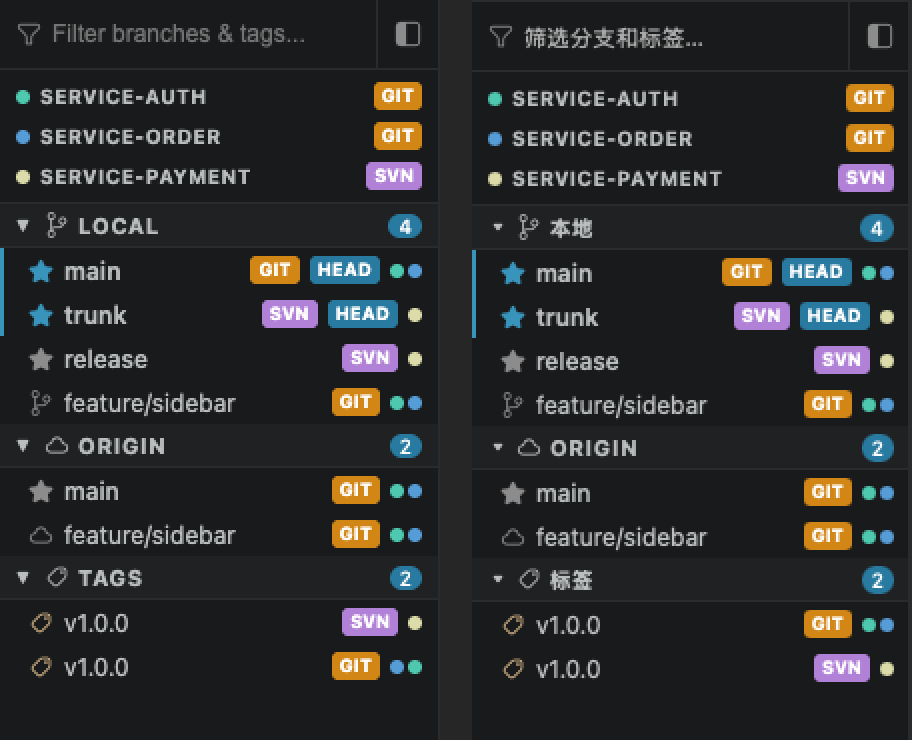
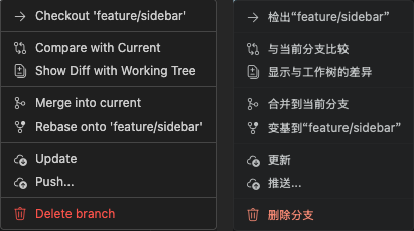

# 分支面板对照与验收（2026-10-01）

## 基准与范围

插件参考：`/Volumes/WorkSSD/Project/VersionDock` 的 `BranchSidebar.tsx`、紧凑模式 `densityGlobalStyles.ts`、`GitLogPanelProvider.ts`、Git/SVN Service。插件工作树保持未修改。

App：当前独立 React / Store / Bridge / Rust 实现。用户附件是修改前的 App 截图，不是插件目标图。本次以真实 Extension Development Host 和源码为依据，排除 AI 与舒适布局。

## 对齐结果

| 功能 | 插件行为及 App 修复 | 验证 |
| --- | --- | --- |
| 仓库/分支筛选 | 单击只选中；双击仓库选择仓库；双击共享分支清除独立仓库选择，并传入该行的全部仓库与完整 ref；再次双击不取消筛选 | UI 回归、远程 origin/upstream 范围测试 |
| 多仓库及混合 VCS | 本地/各远程/标签分别合并；同名 Git/SVN 分开；HEAD 分数、仓库圆点、ahead/behind 汇总；当前/主要分支优先 | 原生混合仓库截图、真实 HEAD 1/2 与全部切换截图 |
| 分组与搜索 | 35px 搜索栏、20px 仓库行、22px 分组标题/分支行；大于 25 个标签自动折叠，支持异步数据及用户展开；复用现有主题/Codicons | 同一 1440×900 viewport 的插件与 App 并排截图、回归测试 |
| 右键菜单 | 区分单击、筛选、HEAD 和右键目标；菜单项、分隔与行间距对齐；沿用视窗边界定位、Escape/失焦关闭、键盘导航 | 真实插件/App 菜单图、回归测试 |
| 检出分支 | 每个关联仓库分别执行；远程分支复用已有本地分支或创建跟踪分支；未提交变更恢复沿用已有后端 | App 两个真实仓库均切换成功；同名 tag/remote 的 Rust 集成测试 |
| 比较/工作区差异 | 追到插件宿主确认两者都需要选择一个仓库；Git 完整 ref 防同名歧义；比较支持 detached tag/hash 作为基准；去掉插件没有的仓库切换 tabs | App 真正列出双方独有提交、工作区增删改及文件内容 diff |
| 合并/变基/更新/推送 | 合并、变基、更新和推送选择 HEAD 实例或首个实例，不额外弹仓库选择；合并/变基传完整 ref；更新遵循策略；推送目标仓库的当前分支，不误推右击的非当前分支 | 分支 UI 回归；真实 Git pull/rebase/remote 集成测试 |
| SVN | 保留 Switch/Merge/Update/Delete，隐藏 Git-only Compare/Rebase/Push；Update 保留当前工作副本分支验证 | App 原生 Switch 后 `svn info` 确认为 `^/branches/release`；Rust SVN 生命周期/合并测试 |
| 标签 | 点击/键盘只选中，不直接筛选日志；检出/合并作用于全部关联仓库，推送用第一个实例；任何关联仓库 detached 在该标签时不显示删除 | App 两个 Git 仓库均 detached、绿色标签和无删除入口截图；UI 回归 |
| 名称歧义 | 分支名称从完整 `refs/heads` / `refs/remotes` 解析；远程跟踪检出也使用完整 ref；UI 展示短名称，操作保留完整 ref | 真实 tag/main、tag/origin/topic 冲突及 tracking checkout 集成测试 |

## 清理

删除只有旧测试在调用的 `mergeBranches` / `splitVisibleBranches` 与“只显示主要分支”规则；原有远程分组和去重测试迁移到实际使用的 `buildSidebarModel`。主要分支判断复用 `branchColor.ts`。删除比较面板的冗余仓库 tabs/CSS 和不必要的仓库选择器，菜单复用共享组件。

同步两处旧翻译断言到当前插件正式文案；工作区差异标题展示短 ref，实际 diff 请求继续使用完整 ref。

## 验证结果与边界

- `npm run check:frontend`：TypeScript、ESLint、元数据/独立性/窗口/i18n 检查、512 项测试、bindings 校验及 production build 全部通过。
- Rust：fmt、clippy 全部通过；`VERSIONDOCK_REQUIRE_VCS_TESTS=1 cargo test --locked --manifest-path src-tauri/Cargo.toml -- --test-threads=1`：117 项全部通过，Git/SVN 均可用，未跳过相关工具。
- 默认并发 Rust 测试曾出现 `svn_incoming_probe_chains_pending_new_revision_and_prevents_stale_overwrite` 时序失败（116/117）；串行全量复跑通过。该缓存实现未在本轮修改，没有据此宣称默认并发检查全绿。
- 真正的 Tauri App 验证包括：共享分支检出、HEAD 1/2、标签检出、detached 删除入口保护、分支比较、工作区差异与文件内容、SVN Switch。操作对象均为临时验收仓库，不是用户工作仓库。
- 本轮真实网络远端账号发布/凭据和 Windows/Linux 未做手动验收；推送/拉取等后端使用已有真实本地远端集成测试。视觉范围为分支面板及其菜单，其他面板不属于本次像素验收。

## 截图证据

`manual/branch-sidebar-2026-10-01/` 保存原始截图及未重绘的并排裁剪。左侧插件，右侧 App：

原生交互证据：`native-comparison-populated.png`、`native-working-file.png`、`native-checkout.png`、`native-checkout-complete.png`、`native-tag-checkout.png`、`native-current-tag-menu.png`、`native-svn-menu-final.png`。

## 用户反馈：选中与加载颜色统一

用户要求选中背景和加载提示使用灰色，覆盖此前视觉对照时使用的蓝色宿主选中 token。

- 统一 `--versiondock-selection-background/foreground/inactive-background` 与 `--versiondock-loading-foreground/background`。旧 `--versiondock-selected`、`--versiondock-selection` 和 VS Code 列表主题别名接到这组变量，消除一组未定义的 selection 别名及多主题蓝色覆盖。
- 分支/仓库、同步提交、文件历史/详情、冲突列表、合并选择及菜单选中态共用主题的中性背景；浅色主题前景使用深色正文。
- 分支/日志、差异占位、状态栏操作、同步与子树 busy 提示、启动/详情加载均使用中性加载 token。主按钮、HEAD/VCS 徽章、分支边线及警告/错误颜色保持语义区分。
- 原生当前 App 截图：`manual/branch-sidebar-2026-10-01/native-neutral-selection.png`，已确认分支 api 的灰色选中背景。
- 对真实 `src/styles.css` 在独立 WebKit 验证程序中进行 8 主题计算样式检查（不是在 App 注入模拟状态），各列表/加载 token 一致，浅色前景正确；结果：`neutral-theme-colors.json`。默认深色 selected=`rgb(36,37,38)`、loading=`rgb(140,140,140)`，默认浅色 selected=`rgb(234,234,234)`、loading=`rgb(96,96,96)`。
- 前端 50 个测试文件/512 项通过；类型、lint、i18n、bindings 和 production build 通过。原生 refresh 时加载状态很短，未取得本次稳定的原生 loading 截图；加载颜色以真实 CSS 的 WebKit 计算样式核验为证据。
