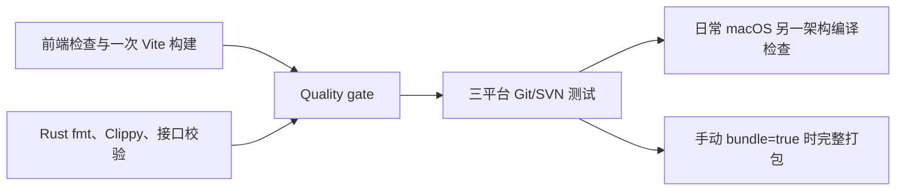

# CI 与 Release 耗时优化

## 已确认的瓶颈

GitHub 上 2026-08-28 最近一次完整成功 CI 耗时 39 分 37 秒。前置质量检查占 7 分 58 秒；Windows SVN 首次构建占 4 分 51 秒，Rust 编译及测试占 9 分 13 秒，完整安装包构建占 15 分 07 秒。Windows 测试本身约 41 秒，主要成本来自编译。

Rust 缓存原配置为 `src-tauri -> src-tauri/target`，但目标目录相对于 workspace 解析，实际指向 `src-tauri/src-tauri/target`。Actions 日志证实该错误路径，因此缓存命中也不能复用真正的编译产物。

上述耗时来自历史运行，不代表当前代码或新工作流的实测耗时。

## 普通 CI

- 保留 `main` push / pull request 触发和取消被新提交替代的运行。
- 前端任务只安装 Node 与 minisign，执行元数据、独立性、窗口、国际化、TypeScript、ESLint、发布测试、前端测试和 Vite 构建，不编译 Rust。
- Rust 任务检查格式、Clippy、生成接口及默认值的一致性。`Quality gate` 保留原检查名称，通过 `always()` 加显式结果判断汇总，失败、跳过或取消都不能放行平台任务。
- 三平台运行完整 Rust 测试，强制要求真实 Git/SVN 工具可用；Windows SVN 的 Unicode 路径验证及独立缓存继续保留。
- 日常 macOS 在宿主架构执行测试，并对另一架构执行带 `tauri/custom-protocol` 的编译检查。这不等于另一架构的链接、安装或实机运行验收。
- 日常任务不安装前端 npm 依赖，也不执行完整安装包构建。需要临时包时，在 Actions → CI → Run workflow 勾选 `bundle`，三平台完整打包并上传私有安装包，保留 7 天。

## 正式发布

先解析已有正式标签、校验版本并固定 SHA，再并行执行完整前端检查与 Rust 检查。原有 `Verify release` 汇总检查必须成功，三平台构建才会开始。

前端检查中保留对旧版本标签的兼容：旧标签缺少新拆分的 npm 脚本时，执行原有各项前端检查和 Vite 构建。Rust 校验仍使用标签中已有的接口检查与完整 Rust 检查命令。

macOS universal、Windows x64、Linux x64 保持正式 release profile 和更新签名。三平台成功后，原有签名、版本、平台覆盖、文件哈希、草稿上传、完整性验证和公开发布流程继续执行。

## 前端与缓存复用

- 每次 workflow 只生成一份 `dist`，前端 artifact 名称带固定源码 SHA，平台任务 checkout 同一 SHA 并下载当前运行的 artifact。
- 平台构建通过临时 Tauri 配置将 `beforeBuildCommand` 设为 `null`，直接使用已验证的 `dist`，避免再次运行 Vite 和类型导出检查。平台窗口、更新配置和签名配置仍按原方式合并。
- 前端 artifact 使用 `frontend-ci-*` / `frontend-release-*` 名称。公开发布只下载 `release-*` 安装包 artifacts，前端资源不会作为单独附件上传到公开仓库。
- 同一次工作流重新执行时允许替换其私有 artifacts，避免固定名称发生上传冲突；这不改变公开 Release 已发布附件禁止覆盖的约束。
- Rust 缓存统一使用 `src-tauri -> target`，新命名空间为 `v1-versiondock-target`，避开旧的错误缓存。
- CI / Release 的 Rust 质量检查共用 `native-quality` 缓存键；日常平台测试使用 `native-tests`，完整打包使用 `native-bundles`。平台、架构、工具链和依赖锁文件仍由缓存 action 区分，避免测试缓存阻止完整打包缓存的建立。
- 接口生成检查加入 `--locked`，防止检查过程中更新 Cargo 锁文件。
- 本地通过 `rust-toolchain.toml` 固定 Rust 1.99.0，CI 与 Release 的所有 Rust 安装步骤显式使用相同版本。升级工具链时同步修改这几处配置并重新执行检查，避免浮动 `stable` 带来本地与 CI 的 Clippy 规则差异。
- 平台任务在测试失败时也保存 Rust 依赖缓存；测试仍必须通过，缓存不会替代检查结果。这样可避免启动失败后再次冷编译全部依赖。

本地 `npm run build`、`npm run check:frontend` 和 `npm run check` 仍执行原有完整校验。新增 `build:frontend` 为纯 Vite 构建，`check:frontend:source` 为前端检查，`check:frontend:ci` 将两者组合；Rust 接口校验由另一任务把关。

## 验证与后续计时

- Actions 配置通过 actionlint（含 ShellCheck），发布逻辑测试 13 项通过。
- 本地完整 `npm run check` 通过：前端 840 项，Rust 221 项通过、6 项默认跳过，包含真实 Git/SVN 集成测试。
- 执行工作流实际汇总命令，验证普通 CI 的 16 种、Release 的 64 种上游结果组合，每组仅全部成功时放行。
- 使用共享前端的临时 Tauri 配置完成本地 Apple Silicon 原生 release 编译；`dist` 的 61 个文件哈希及修改时间全部保持不变，确认没有重复执行前端构建。该验证使用 `--no-bundle`，不代表安装包或更新签名验收。
- 日常 macOS 新增的 Intel 目标检查命令本地执行通过，使用 `x86_64-apple-darwin` 和 `tauri/custom-protocol`。该检查不执行 Intel 程序。
- 后续 CI 的浮动 `stable` 升级到 Rust 1.99.0，触发三处 Clippy 警告：Agent CLI 的延迟初始化和日志测试中的固定长度分块。已按新规则调整，并固定工具链；Rust 1.99.0 下 fmt、全目标/全特性 Clippy（`-D warnings`）、生成接口检查及 221 项 Rust 回归通过，6 项默认跳过。

改动合入 `main` 并推送后才能验证 GitHub 运行耗时。新缓存首次运行仍需要冷构建；至少记录一次成功冷构建和一次依赖未变化的缓存命中运行，并比较关键路径及实际编译耗时。手动 CI 安装包和真实签名 Release 也需各运行一次。配置检查与本地编译不等于 GitHub 三平台工作流已执行。

## Windows 测试程序启动失败

2026-10-06 的 Windows CI 在编译成功后，以 `0xc0000139 / STATUS_ENTRYPOINT_NOT_FOUND` 退出，测试尚未运行；同次 macOS、Linux 和质量检查均通过。

当前 `tauri-build 2.6.3` 通过 `tauri-winres` 的 `compile()` 输出 `rustc-link-arg-bins`，默认 Common-Controls v6 清单只嵌入主程序。库单元测试 EXE 不在这个范围内，与 [Tauri 已知问题 #13419](https://github.com/tauri-apps/tauri/issues/13419) 的构建条件一致。缺少该清单可能让 Windows 加载默认 Common-Controls v5，而测试程序链接的控件 API（例如 `TaskDialogIndirect`）需要 v6。

Windows MSVC 构建改为通过 `build.rs` 的通用链接参数嵌入 `windows-app-manifest.xml`，覆盖主程序、库单元测试和其他链接目标；关闭 Tauri 原有的主程序清单嵌入以避免重复，但继续保留其图标及版本资源。项目清单与当前 Tauri 默认清单相同，升级 `tauri-build` 时需对照上游模板。

Windows CI 先用 `cargo test --no-run --message-format=json` 编译测试，再通过 Windows SDK 的 `mt.exe` 读取每个测试 EXE 的资源 #1，要求存在 Common-Controls v6 依赖，随后运行原有完整测试。编译与清单检查均不可跳过或吞掉错误。

本地验证：Rust fmt、Clippy、221 项 Rust 回归通过（6 项默认跳过）；XML 与上游默认模板一致；PowerShell 语法检查通过，脚本逻辑覆盖有效清单、无测试程序、缺少 v6 依赖和清单读取失败。脚本逻辑测试模拟了 SDK 提取步骤，不代表 Windows PE 或程序启动验收。尚未取得失败 EXE 的导入表，缺失入口点的确切名称与 Windows 启动恢复仍需在新提交的 CI 中验证。
