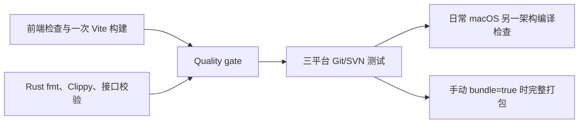
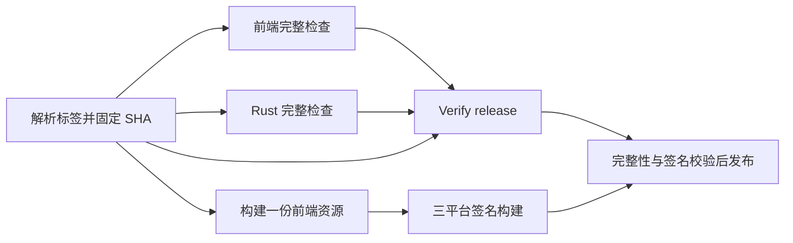

# CI 与 Release 耗时优化

## 已确认的瓶颈

GitHub 上 2026-08-28 最近一次完整成功 CI 耗时 39 分 37 秒。前置质量检查占 7 分 58 秒；Windows SVN 首次构建占 4 分 51 秒，Rust 编译及测试占 9 分 13 秒，完整安装包构建占 15 分 07 秒。Windows 测试本身约 41 秒，主要成本来自编译。

Rust 缓存原配置为 `src-tauri -> src-tauri/target`，但目标目录相对于 workspace 解析，实际指向 `src-tauri/src-tauri/target`。Actions 日志证实该错误路径，因此缓存命中也不能复用真正的编译产物。

上述耗时来自历史运行，不代表当前代码或新工作流的实测耗时。

## 普通 CI

- 保留 `main` push / pull request 触发和取消被新提交替代的运行。
- 前端任务只安装 Node 与 minisign，执行元数据、独立性、窗口、国际化、TypeScript、ESLint、发布测试、前端测试和 Vite 构建，不编译 Rust。
- Rust 任务检查格式、Clippy、生成接口及默认值的一致性。`Quality gate` 保留原检查名称，通过 `always()` 加显式结果判断汇总，失败、跳过或取消都不能放行平台任务。
- 三平台运行完整 Rust 测试，强制要求真实 Git/SVN 工具可用；Windows SVN 的 Unicode 路径验证及独立缓存继续保留。
- 日常 macOS 在宿主架构执行测试，并对另一架构执行带 `tauri/custom-protocol` 的编译检查。这不等于另一架构的链接、安装或实机运行验收。
- 日常任务不安装前端 npm 依赖，也不执行完整安装包构建。需要临时包时，在 Actions → CI → Run workflow 勾选 `bundle`，三平台完整打包并上传私有安装包，保留 7 天。

## 正式发布

先解析已有正式标签、校验版本并固定 SHA，再并行执行完整前端检查、Rust 检查和独立的 Vite 资源构建。三平台在资源构建完成后开始编译，与检查重叠；原有 `Verify release` 汇总检查和所有平台构建必须成功，公开发布才会开始。

前端检查中保留对旧版本标签的兼容：旧标签缺少新拆分的 npm 脚本时，执行原有各项前端检查；独立资源任务统一执行 Vite 构建。Rust 校验仍使用标签中已有的接口检查与完整 Rust 检查命令。

macOS universal、Windows x64、Linux x64 保持正式 release profile 和更新签名。三平台成功后，原有签名、版本、平台覆盖、文件哈希、草稿上传、完整性验证和公开发布流程继续执行。

## 前端与缓存复用

- 每次 workflow 只生成一份 `dist`，前端 artifact 名称带固定源码 SHA，平台任务 checkout 同一 SHA 并下载当前运行的 artifact。
- 平台构建通过临时 Tauri 配置将 `beforeBuildCommand` 设为 `null`，直接使用同一源码提交生成的 `dist`，避免再次运行 Vite 和类型导出检查。正式发布仍等待完整源码检查通过，平台窗口、更新配置和签名配置仍按原方式合并。
- 前端 artifact 使用 `frontend-ci-*` / `frontend-release-*` 名称。公开发布只下载 `release-*` 安装包 artifacts，前端资源不会作为单独附件上传到公开仓库。
- 同一次工作流重新执行时允许替换其私有 artifacts，避免固定名称发生上传冲突；这不改变公开 Release 已发布附件禁止覆盖的约束。
- Rust 缓存统一使用 `src-tauri -> target`，新命名空间为 `v1-versiondock-target`，避开旧的错误缓存。
- CI / Release 的 Rust 质量检查和日常 Linux 平台测试共用 `native-quality` 缓存键；macOS、Windows 日常平台测试使用 `native-tests`，完整打包使用 `native-bundles`。平台、架构、工具链和依赖锁文件仍由缓存 action 区分，避免测试缓存阻止完整打包缓存的建立。
- 接口生成检查加入 `--locked`，防止检查过程中更新 Cargo 锁文件。
- 本地通过 `rust-toolchain.toml` 固定 Rust 1.99.0，CI 与 Release 的所有 Rust 安装步骤显式使用相同版本。升级工具链时同步修改这几处配置并重新执行检查，避免浮动 `stable` 带来本地与 CI 的 Clippy 规则差异。
- 平台任务在测试失败时也保存 Rust 依赖缓存；测试仍必须通过，缓存不会替代检查结果。这样可避免启动失败后再次冷编译全部依赖。
- 三平台测试、普通 CI 的类型导出及 Release Rust 检查统一设置 `CARGO_PROFILE_TEST_OPT_LEVEL=0`、`CARGO_PROFILE_TEST_DEBUG=1`，减少 LLVM 优化和完整调试符号的编译开销；保留 debug assertions 和溢出检查。平台测试设置放在 job 环境中，缓存恢复、预编译和正式测试使用同一配置。本地开发配置不变。
- Windows 通过 `cargo test --lib --no-run` 预编译并校验测试程序清单，再通过 `cargo nextest run --lib` 运行；当前全部 221 项有效 Rust 测试均位于库中，避免为零测试的 `main.rs` 额外编译主库的 staticlib/cdylib 和二进制测试程序。类型导出检查也显式指定 `--lib`。macOS、Linux 平台和 Release 完整检查仍使用原来的全目标测试命令；新增独立 `tests/` 目录或主程序测试时需同步调整 Windows 命令。
- Windows 缓存增加 `windows-tests-o0-debug1-lib-v1` 区分该测试配置，避免旧的优化/完整符号缓存命中后无法保存新编译产物。普通 CI Rust 任务的测试配置通过 job 环境变量参与 Rust cache 的键计算。

本地 `npm run build`、`npm run check:frontend` 和 `npm run check` 仍执行原有完整校验。新增 `build:frontend` 为纯 Vite 构建，`check:frontend:source` 为前端检查，`check:frontend:ci` 将两者组合；Rust 接口校验由另一任务把关。

## 验证与后续计时

- Actions 配置通过 actionlint（含 ShellCheck），发布逻辑测试 13 项通过。
- 本地完整 `npm run check` 通过：前端 840 项，Rust 221 项通过、6 项默认跳过，包含真实 Git/SVN 集成测试。
- 执行工作流实际汇总命令，验证普通 CI 的 16 种、Release 的 64 种上游结果组合，每组仅全部成功时放行。
- 使用共享前端的临时 Tauri 配置完成本地 Apple Silicon 原生 release 编译；`dist` 的 61 个文件哈希及修改时间全部保持不变，确认没有重复执行前端构建。该验证使用 `--no-bundle`，不代表安装包或更新签名验收。
- 日常 macOS 新增的 Intel 目标检查命令本地执行通过，使用 `x86_64-apple-darwin` 和 `tauri/custom-protocol`。该检查不执行 Intel 程序。
- 后续 CI 的浮动 `stable` 升级到 Rust 1.99.0，触发三处 Clippy 警告：Agent CLI 的延迟初始化和日志测试中的固定长度分块。已按新规则调整，并固定工具链；Rust 1.99.0 下 fmt、全目标/全特性 Clippy（`-D warnings`）、生成接口检查及 221 项 Rust 回归通过，6 项默认跳过。

改动合入 `main` 并推送后才能验证 GitHub 运行耗时。新缓存首次运行仍需要冷构建；至少记录一次成功冷构建和一次依赖未变化的缓存命中运行，并比较关键路径及实际编译耗时。手动 CI 安装包和真实签名 Release 也需各运行一次。配置检查与本地编译不等于 GitHub 三平台工作流已执行。

## Windows 测试程序启动失败

2026-10-06 的 Windows CI 在编译成功后，以 `0xc0000139 / STATUS_ENTRYPOINT_NOT_FOUND` 退出，测试尚未运行；同次 macOS、Linux 和质量检查均通过。

当前 `tauri-build 2.6.3` 通过 `tauri-winres` 的 `compile()` 输出 `rustc-link-arg-bins`，默认 Common-Controls v6 清单只嵌入主程序。库单元测试 EXE 不在这个范围内，与 [Tauri 已知问题 #13419](https://github.com/tauri-apps/tauri/issues/13419) 的构建条件一致。缺少该清单可能让 Windows 加载默认 Common-Controls v5，而测试程序链接的控件 API（例如 `TaskDialogIndirect`）需要 v6。

Windows MSVC 构建改为通过 `build.rs` 的通用链接参数嵌入 `windows-app-manifest.xml`，覆盖主程序、库单元测试和其他链接目标；关闭 Tauri 原有的主程序清单嵌入以避免重复，但继续保留其图标及版本资源。项目清单与当前 Tauri 默认清单相同，升级 `tauri-build` 时需对照上游模板。

Windows CI 先用 `cargo test --lib --no-run --message-format=json` 编译测试，再通过 Windows SDK 的 `mt.exe` 读取每个测试 EXE 的资源 #1，要求存在 Common-Controls v6 依赖，随后运行全部库测试。编译与清单检查均不可跳过或吞掉错误。

本地验证：Rust fmt、Clippy、221 项 Rust 回归通过（6 项默认跳过）；XML 与上游默认模板一致；PowerShell 语法检查通过，脚本逻辑覆盖有效清单、无测试程序、缺少 v6 依赖和清单读取失败。脚本逻辑测试模拟了 SDK 提取步骤，不代表 Windows PE 或程序启动验收。后续 Windows 运行 `37441744989` 已通过实际 SDK 清单校验并开始运行测试，证实测试程序启动恢复；尚未取得此前失败 EXE 的导入表，缺失入口点的确切名称仍未确认。

## 本轮 Windows 与类型导出编译优化

同次 CI 总耗时 36 分 39 秒，关键路径为 Rust 检查 10 分 7 秒，然后 Windows 26 分 20 秒；前端 4 分 5 秒已和 Rust 检查重叠。Windows 的 Rust 与 SVN 缓存均未命中：测试程序编译占 20 分 18 秒，测试尚未执行。Rust 检查中类型导出占约 6 分 56 秒，Clippy 编译约 1 分 49 秒。

已对上述两段编译使用前述库测试与较轻的测试配置。本地以相同配置编译库测试耗时 1 分 18 秒、执行 22.97 秒，221 项通过、6 项默认跳过；接口/默认值一致性校验和 Clippy 通过。此为 macOS 本地数据，不能与 Windows runner 的 20 分 18 秒直接计算加速比例；Windows 冷缓存及缓存命中后的实际耗时需重新运行 CI 记录。

## Windows 测试失败与挂起

运行 `37441744989` 的 Windows 日志显示，预编译耗时 19 分 40 秒，正式测试命令又编译约 5 分 5 秒；此次代码尚未包含较轻的测试配置及 `--lib` 优化。大部分测试在正式开始后约 4 分钟内结束，但有 13 项报告失败，`real_svn_file_kind_probes_preserve_deleted_moved_and_missing_conflicts` 长时间未退出，最终被任务超时取消。普通测试运行器未在取消前输出失败断言详情，因此不能据此认定所有失败原因。

已修正能从源码确认的夹具问题：两项仓库扫描断言改用平台路径组件比较；三处 SVN 本地仓库 URL 使用 `Url::from_file_path`；共用 SVN 命令显式禁止交互；共用仓库夹具 ID 按路径及类型生成，避免不同测试仓库复用同一缓存键。Windows 临时 runner 显式关闭 Git 的全局自动换行转换，具体测试的本地 Git 配置仍可覆盖。

Windows 使用固定 `cargo-nextest 0.9.146`，每个测试独立进程运行，避免进程级全局状态相互干扰；`.config/nextest.toml` 配置每 60 秒报告慢测试，连续两次后终止该测试，其他测试继续执行。失败输出立即显示并在最后汇总，JUnit 报告保存在私有 `windows-test-report-*` artifact，保留 7 天。原挂起测试增加阶段日志，便于从超时输出定位停滞步骤。编译和整个任务仍受原有任务超时约束；单项测试超时不包含编译耗时。

本地使用相同 Nextest 版本、CI 配置和测试编译设置验证：221 项通过、6 项保持默认忽略，测试运行 22.356 秒，JUnit 报告成功生成。Windows 的其余失败仍需下一次 CI 提供断言和实际超时阶段，不能把本地通过当作 Windows 已全部修复。

### Nextest 首次 Windows 回归的六项失败

后续 Windows 日志显示测试编译 1 分 2 秒，测试运行 241.365 秒：204 项通过、6 项失败、4 项默认忽略，没有测试超时。Windows 与 macOS 的测试数量因平台条件编译不同，不直接比较总数；本次已能取得全部失败断言。

| 失败范围 | 原因及修正 |
| --- | --- |
| 补丁导出后 `git am`、外部 Git 文件监听夹具 | Windows `canonicalize` 产生 `\\?\` 扩展路径，而这些 Git 子命令不接受该路径格式。公共目录规范化及监听夹具使用 `dunce::canonicalize`，在安全时返回普通路径，保留必须使用扩展形式的路径。继续用真实 `git am` 和监听事件验收。 |
| SVN 仅提交选中文件 | 文本断言写死 `/` 路径分隔符；改为解析 `svn status --xml` 并比较路径组件与实际状态，同时保留仓库修订中不包含未选中文件的断言。 |
| SVN 提交认证重试、账号切换 | SVN 的 stdin 密码读取使用平台原生换行（上游 `svn_cmdline__stdin_readline` 使用 `APR_EOL_STR`），Windows 会把单独追加的 LF 留在密码中。三个密码输入入口统一发送原始字节并关闭管道，以 EOF 结束；继续使用 `--password-from-stdin`。已有真实账号切换、认证重试测试保留，并增加认证检出验证。 |
| SVN 后台探测串联 | 测试只模拟计数探测，遗漏工作副本修订读取，导致等待真实 SVN 进程；固定等待 120 毫秒也受 runner 调度影响。补齐修订 mock，并给四项并发时序测试使用 Tokio 暂停时钟，保留旧请求、回滚和失效保护断言。`test-util` 仅用于测试构建。 |

本地验证：Nextest 221 项通过、6 项默认忽略，运行 21.845 秒；普通 Cargo 测试同样 221 项通过、6 项默认忽略，运行 21.48 秒。Rust fmt、全目标/全特性 Clippy（`-D warnings`）及接口/默认值一致性检查通过。这些修正仍需提交后的 Windows CI 验证，不能仅凭本地回归声明 Windows 全部通过。

## 跨版本 Release 缓存与桌面链接优化

2026-10-06 第二次发布 `v0.1.2`（运行 `37472574928`）总耗时 34 分 22 秒。Windows Release 任务占 22 分 32 秒，其中 Rust 构建 18 分 14 秒，安装包制作约 36 秒，缓存收尾 1 分 54 秒。该任务仍明确记录 `No cache found`；`v0.1.1` 与 `v0.1.2` 的 `native-bundles` 缓存虽然键相同，却保存在不同 ref 下，新标签不能读取另一个标签的缓存。同一提交的普通 CI（`37472508707`）Windows 缓存完全命中，任务已缩短到 7 分 59 秒。

### 缓存预热

- 新增 `Warm release cache` 工作流，在 `main` 上维护与正式发布相同的 `native-bundles` 缓存，覆盖 macOS universal、Windows x64 和 Linux x64。工具链、runner、Rust 目标及缓存键与 Release 一致。
- `main` 上推送 Cargo 清单、锁文件、Rust 工具链、Cargo 配置或相关发布工作流变更时自动运行；也可在 Actions 手动运行并选择 `main`。其他分支的手动运行不生成共享缓存。
- 预热生成一次前端资源，使用正式 release profile 和 `--no-bundle` 编译应用，不制作安装包、不加载签名凭据、不执行公开发布。精确命中现有缓存时跳过原生编译。预热不会替代 CI 或 Release 的任何检查。
- 标签 Release 只恢复缓存，避免为每个标签再次压缩上传只能由该标签访问的缓存。手动从 `main` 启动 Release 时仍可保存 `main` 缓存。质量检查同样复用普通 CI 在 `main` 保存的 `native-quality` 缓存。
- **首次合入后，先等待 `Warm release cache` 三平台成功，再发布新标签。** 初始化完成后，依赖未变化时仍可同时推送 `main` 和版本标签，新标签可恢复上一次 `main` 的缓存。依赖变化较大时，先完成当次预热可进一步提高命中率。缓存被淘汰、runner 或工具链变化时仍可能冷构建。

### 测试配置与库输出

Release Rust 检查使用与普通 CI 相同的较轻测试配置，覆盖接口生成和完整测试；格式、Clippy、真实 Git/SVN 测试、签名校验及完整发布门槛保持。`v0.1.2` 的接口检查曾占 2 分 45 秒，完整测试编译占 4 分 31 秒，而测试本身仅 18.20 秒，统一配置用于减少重复编译。

项目仅交付桌面应用，库输出改为 `rlib`，由 Rust 主程序链接，停止生成无人消费的 `staticlib`、`cdylib`，减少额外代码生成和链接。未来增加移动端或 C ABI 使用方时需重新配置对应库输出。`lto = "thin"`、`codegen-units = 1` 和符号裁剪保持，编译并行度调整需要另行比较耗时、体积和性能。

配置和本地验证不代表 GitHub 预热已经执行；合入后分别记录首次预热、后续标签缓存恢复及三平台实际打包结果。

本轮本地验证：actionlint（含 ShellCheck）通过；检查三平台矩阵及缓存参数一致、Release/CI 测试配置一致、预热仅在 `main` 运行且不引用签名 Secret、公开发布仍等待完整验证与所有平台构建成功。发布逻辑 13 项通过；Rust fmt、Clippy、完整 Rust 测试通过（221 项成功、6 项原有忽略项），接口与默认值一致性检查通过。Apple Silicon 的 Tauri 原生 Release 构建使用 `--no-bundle` 成功，Cargo 元数据确认仅有 `rlib` 和主程序输出；该结果不等于 Windows、Intel Mac 或安装包签名验收。

## v0.1.4 后的并行与测试缓存优化（2026-10-07）

核对 [v0.1.4 Release](https://github.com/chenqinru/VersionDockDesktop/actions/runs/37497043855) 日志，三平台均精确命中 `native-bundles` 缓存。发布总耗时 18 分 23 秒，Windows 构建任务耗时 11 分 23 秒，其中项目编译与链接 8 分 55 秒、安装包制作约 36 秒；macOS 两架构项目编译合计 6 分 14 秒。依赖缓存已经生效，进一步增加相同依赖的缓存无法消除项目自身的编译成本。

原流程在完整检查结束后才启动构建。现将 Vite 资源构建拆为独立任务，资源生成后立即启动三平台原生构建，与完整检查并行：

- 构建与检查都 checkout 固定的源码 SHA，前端 artifact 从当前运行下载。检查失败、取消或跳过时，`Verify release` 失败，即使所有安装包都构建成功也不执行公开发布。
- `publish` 继续同时依赖 `verify` 和三平台矩阵 `build`，保持公开发布串行、平台覆盖、签名与哈希校验、完整草稿公开，以及 GitLab 镜像发布的现有门槛。
- 同次 [普通 CI](https://github.com/chenqinru/VersionDockDesktop/actions/runs/37496951867) 的 Linux 测试未命中缓存，冷编译占 11 分 35 秒，测试执行约 19 秒。现三平台测试统一采用 `opt-level=0`、`debug=1`；日常 Linux 测试复用前置质量任务的 `native-quality` 依赖缓存。
- 测试参数放在 job 环境中参与缓存键计算，避免预编译和正式测试采用不同配置。macOS、Windows 的环境键改变后可能需要一次预热；测试优化不改变发布优化级别、更新包签名或本地开发配置。

按本次时间分布，检查与构建并行有约 4 分钟等待可压缩；这是结构上的估算，实际排队、编译耗时及 GitLab 镜像上传耗时需要下次发布确认。

### 编译并行度的体积取舍

在本地 Apple Silicon 使用同一份源码和前端资源、正式 `release` 与 `tauri/custom-protocol` 配置进行对比。只覆盖项目自身的 `codegen-units`，依赖维持原参数；每次仅清理隔离目录中的项目产物，确认日志只重新编译 `versiondock-desktop`。初次迁移缓存导致的依赖重建未纳入比较。MB 为十进制单位，测量的是主程序，未制作安装包。

| 项目编译单元 | 单次构建耗时 | 主程序大小 | 相比原参数体积增加 |
| --- | ---: | ---: | ---: |
| 1（原参数） | 138.29 秒 | 19.07 MB | — |
| 2 | 88.13 秒 | 25.79 MB | 35.26% |
| 4 | 65.39 秒 | 26.86 MB | 40.83% |
| 16 | 58.13 秒 | 29.27 MB | 53.50% |

为保留此前的安装包体积优化，本轮不调整 `codegen-units=1`、ThinLTO 或符号裁剪。上述数据是本地单次构建对比，不代表 Windows runner 的加速比例，也不证明应用运行性能。编译参数通过命令行临时覆盖，未写入项目配置；构建目录位于系统临时目录，未替换已安装 App 或原有安装包。

本轮验证：actionlint 通过；解析实际工作流依赖图，确认构建无需等待检查、发布仍依赖完整检查与全部构建，并执行 80 种上游结果组合的实际 shell 汇总命令，仅全部成功时放行。前端完整检查与构建通过，860 项前端测试、20 项发布测试通过；采用统一测试配置的接口/默认值校验、Rust fmt、全目标/全特性 Clippy 和完整 Rust 回归通过，226 项通过、6 项原有忽略项。GitHub 上的三平台新流程与实际提速需提交推送后验证。
