# AI 复刻对照检查（2026-10-03）

结论：上一版没有完整对齐。本轮打开隔离的 VS Code Extension Development Host 与 macOS Tauri App，对照真实界面及插件源码，修正实际发现的遗漏。下列截图均来自本轮；模型输出由本地协议模拟提供，Git 仓库、Diff、冲突读取和原生窗口均为真实环境。

插件源码保持只读，在 `/tmp/versiondock-ai-audit/plugin` 的副本构建验收。App 使用独立 `com.versiondock.aiaudit` 配置与编译目录；未覆盖用户开发窗口、账号配置或仓库。GitHub Copilot 按用户要求排除。

## 检查步骤与结果

| 步骤 | 范围 | 结果与依据 |
| --- | --- | --- |
| 1 | 提交信息生成 | 原生入口可以生成消息；候选内容由真实 Git 读取。停止/失败恢复草稿、请求替换和跨工作区隔离由生命周期测试验证。 |
| 2 | 单提交/聚合提交解释 | 补齐日志右键入口和自动生成。解释区移到详情左栏顶部；工具栏按钮、三阶段、渐变、逐字输出、停止、元数据和截断提示对齐。单提交和两提交聚合均在原生 App 实际生成。 |
| 3 | AI 代码审查 | 两端使用同一合成仓库，完成审查并展示严重度、证据、影响与建议。桥接保留指纹定位和失效复审；锚点、混合暂存/工作区来源有测试。 |
| 4 | AI 提交拆分/历史重组 | 两端生成并展示两组提交，组操作与消息生成入口对照；修正字体变量、菜单顺序和专用图标、生成期间组结构锁定、旧消息取消、原页面返回。真实 Git/SVN 集成测试覆盖应用、历史 tree 保持、状态过期、恢复引用、外部索引锁和 hook 干扰。历史重组应用本轮以真实仓库集成测试为证，未在本轮原生窗口执行写入。 |
| 5 | AI 设置/提示词 | API 与四种 CLI 的配置字段逐项对照源码。设置下拉复用统一控件并支持键盘；旧提供商检测结果和密钥草稿不能串到新配置。五类提示词文件名、优先级、编辑和重置由源码/测试验证；本轮截图展示 CLI 设置，没有调用四家真实账号。 |
| 6 | AI 冲突解决 | 两端读取同一真实 Git 两块冲突并完成预览。补齐顶部按钮、逐块写入、进度、完成提示、侧边来源标记和有效冲突上下文扩展。App 实际停止写入后恢复原草稿；源文件仍含冲突标记、Git 仍为 `UU`。 |
| 7 | 历史消息重新生成 | 原生编辑提交信息对话框实际完成生成，随后取消对话框，没有改写测试历史。 |

## 本轮修正的关键偏差

- 日志单选、多选及跨仓库聚合选择缺少 AI 解释入口；补齐入口并校验异步载入后的选择，防止解释错误提交。
- 提交解释原先位于文件列表底部且只有简单 Markdown；现按插件放置到左栏顶部，完整状态与动画由共享组件维护。修正 React StrictMode 下自动生成被误取消、完成结果被离开页面误标停止，以及完成后持续运行计时器的问题。
- AI 页面关闭原先固定返回日志并取消无关请求；现回到打开前的页面，仅取消当前审查/拆分任务。重新分析或离开时，旧组消息不能回写新方案。
- 拆分原先漏掉重命名源路径并错误统计以 `++` / `--` 开头的代码；保留重命名/复制信息、Git 引号/八进制 UTF-8 路径，按 hunk 统计增删。阻止空组 ID；SVN 逐组报告进度。
- Composer 的提交消息提示词原先可能覆盖 JSON 输出协议；现明确限定到每组 message，最后再次约束完整 JSON 与单元覆盖。
- 冲突原先直接批量填入且没有写入动画。现在逐块预览，停止、错误、离开和切换工作区恢复生成前的草稿及缓存。生成期间锁定编辑，完成后由用户人工应用。
- 冲突响应兼容插件的对象/顶层数组、数字字符串索引、字符串/字符串数组/lines 字段、嵌入 JSON 及 CRLF。覆盖/重复/残留标记仍严格拒绝；只修复格式错误，不修复覆盖错误。仅纠正有唯一内容归属的闭环索引串位。
- 冲突上下文原先包含末尾标记且可能混入相邻冲突；现以零基行号排除标记和其他块。前端将窄标记结果扩展到有效块，避免丢失共同上下文。

## 截图对照

### 1. 提交信息

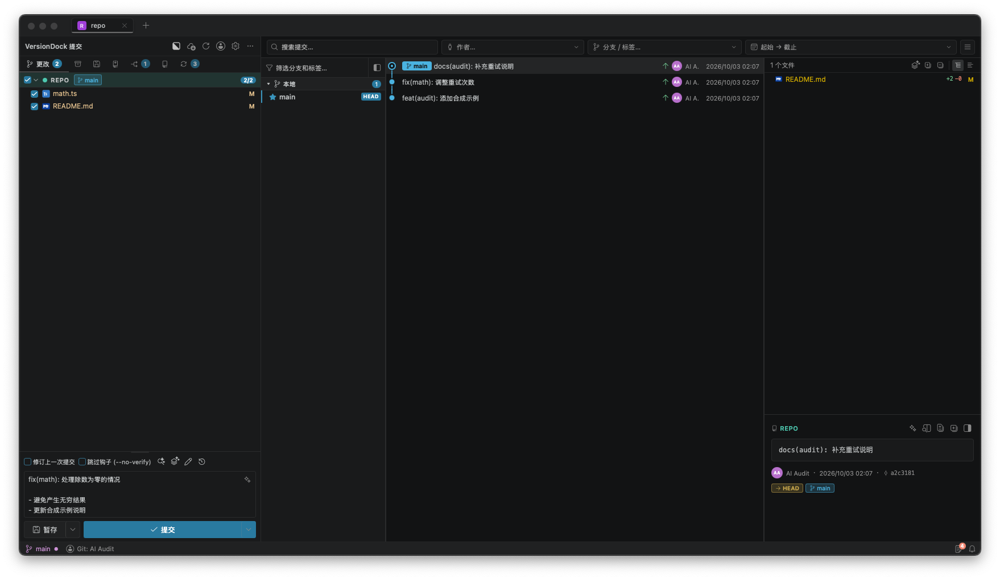

### 2. 提交解释

插件：

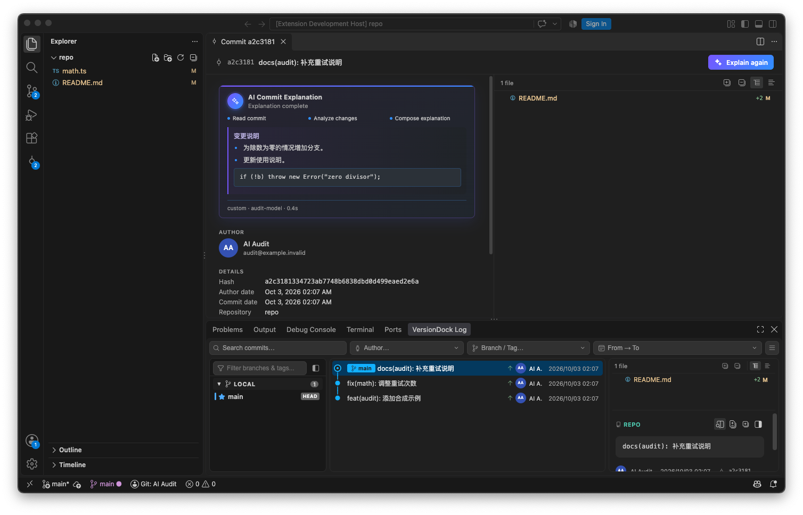

App 最终解释布局：

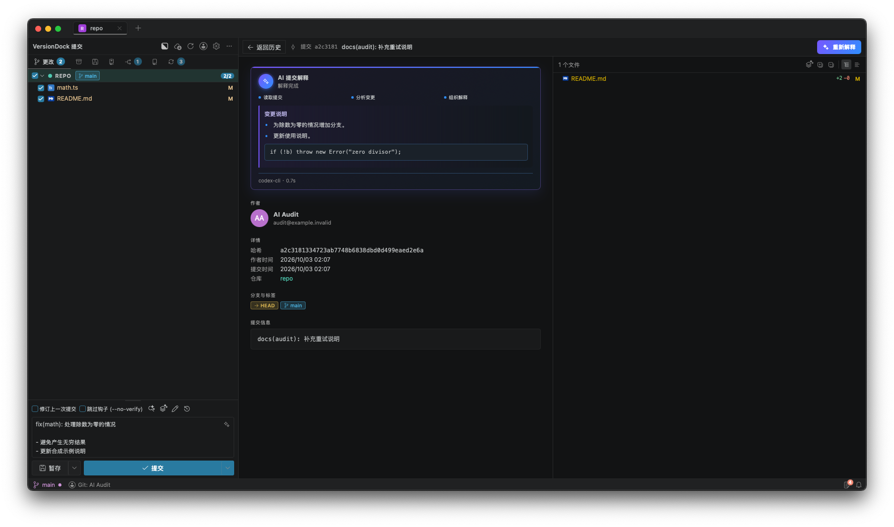

App 两提交聚合：

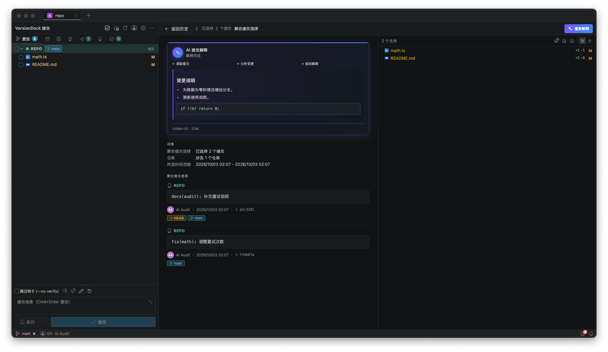

### 3. 审查

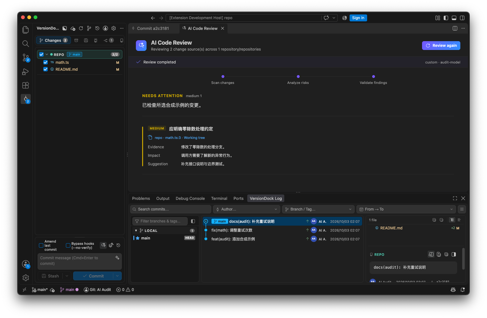

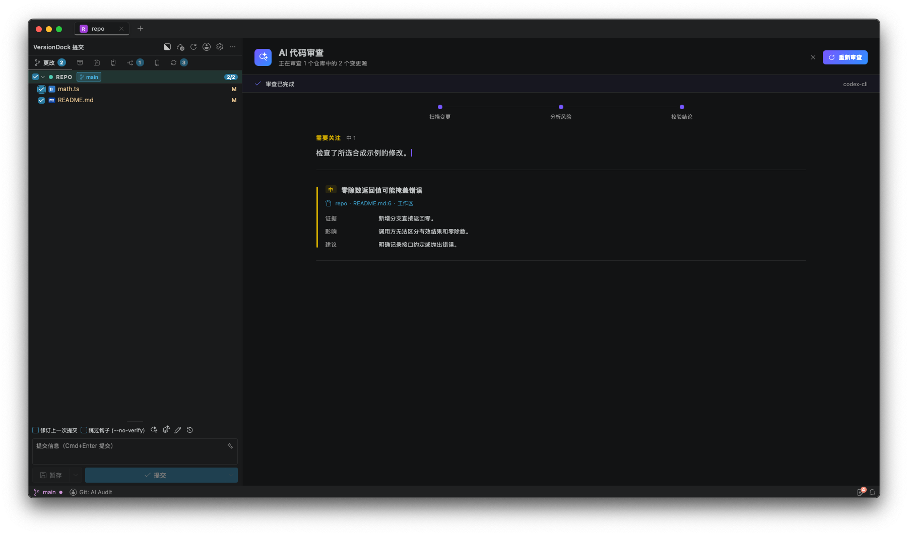

### 4. 拆分

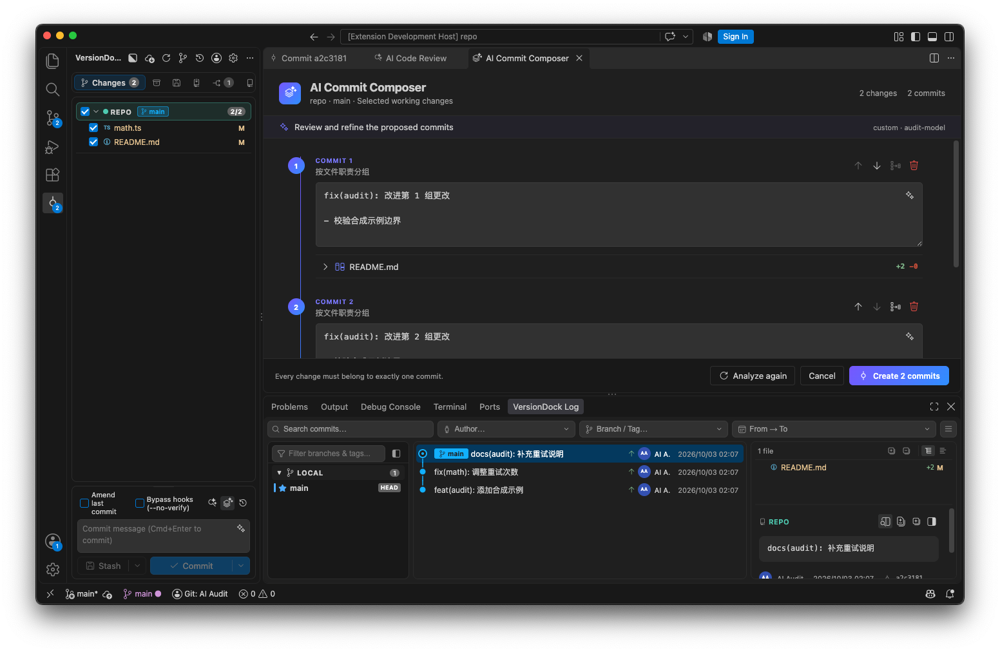

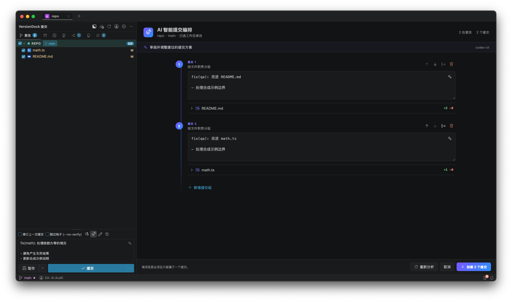

### 5. 设置

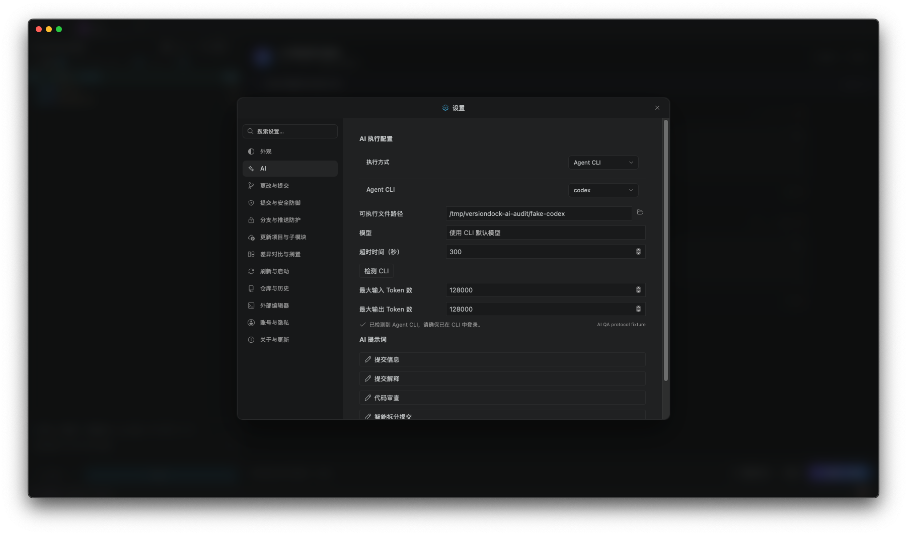

### 6. 冲突预览与停止

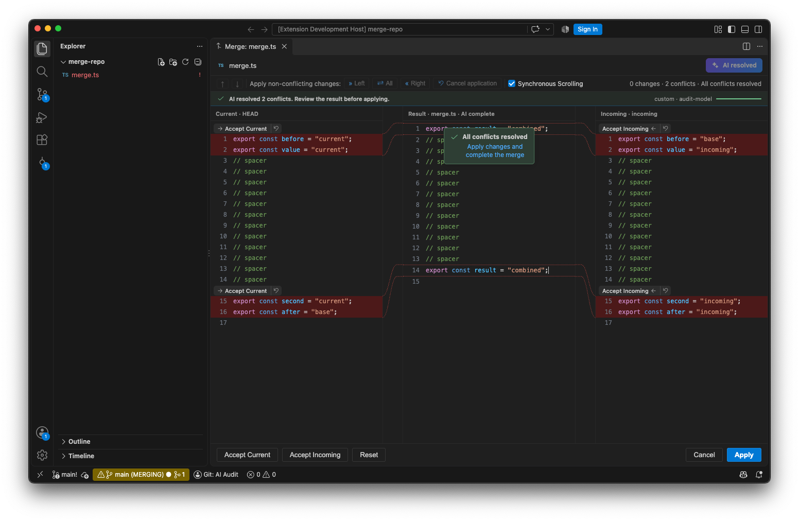

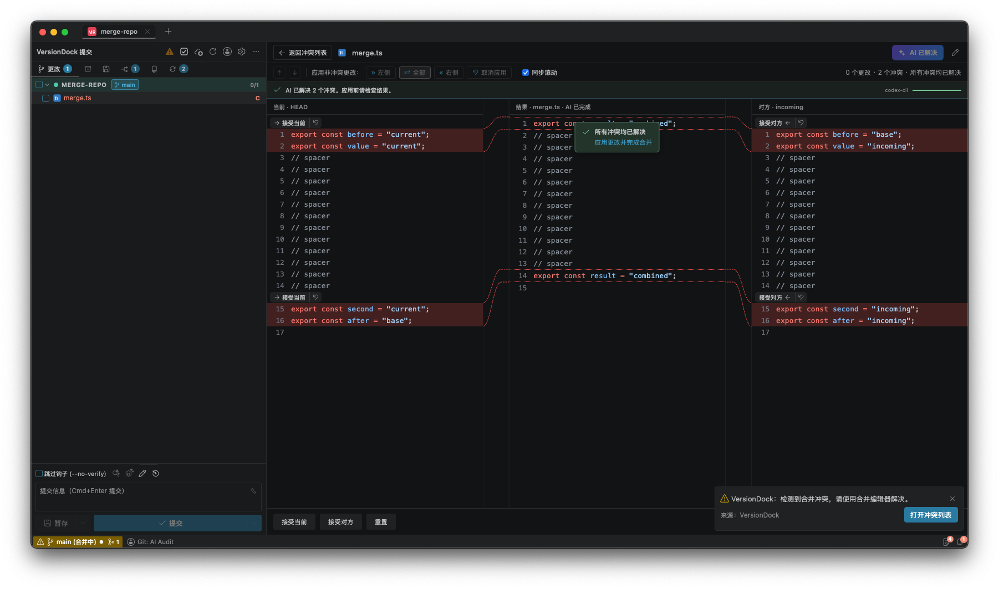

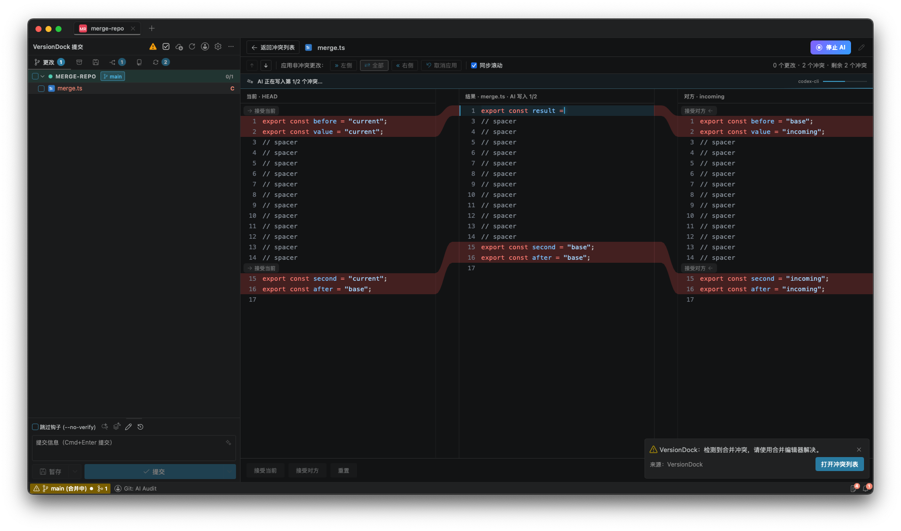

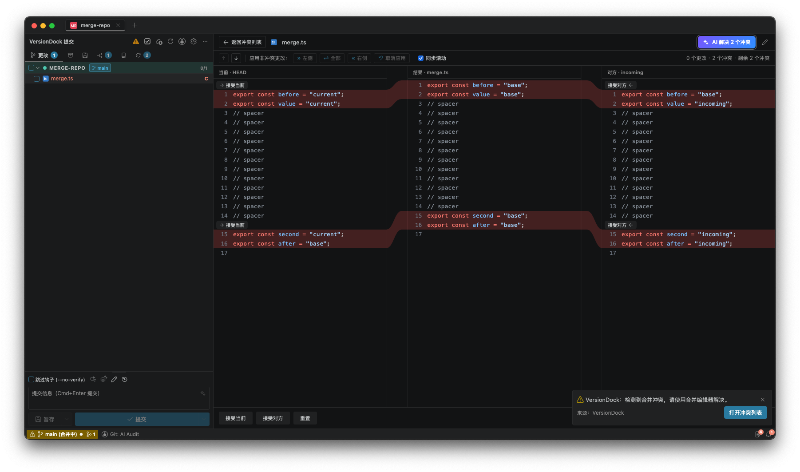

### 7. 历史消息

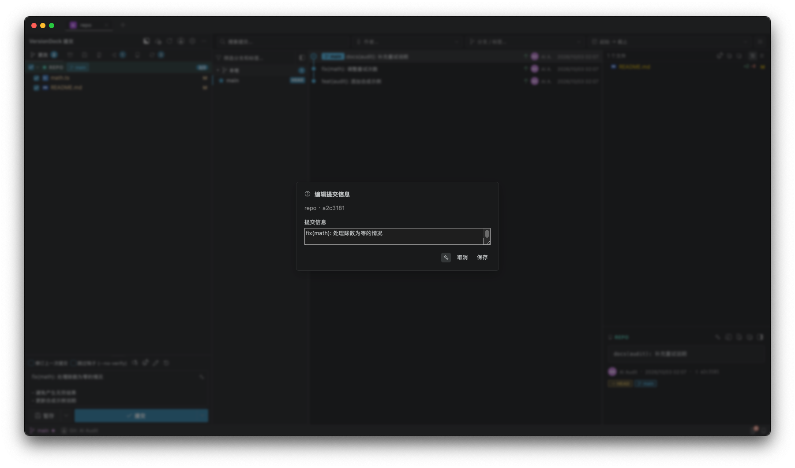

## 验证结果与边界

- `npm run check:frontend`：68 个测试文件、600 项通过，类型、lint、国际化、独立性、绑定检查和构建通过。构建仍有原有大 chunk 提示。
- `npm run check:rust`：156 项通过，1 项真实 Codex 模型测试默认跳过；fmt、clippy 通过。真实模型的上一轮验收单独记录，不算本轮模型调用证据。
- `git diff --check` 通过；插件原工作树未修改；未创建 Git 提交。
- 本轮 API 服务、CLI 输出都是合成协议模拟。插件早期一次冲突失败由验收服务未识别任务造成，修正模拟服务后两端完成；该失败没有被当作产品缺陷修改插件。
- 真实 OpenAI/Claude/Gemini/自定义服务账号以及 Claude/Antigravity/OpenCode 账号调用，Windows/Linux 原生界面仍未逐一实测。因此不能据此声称所有提供商和平台均已完整验收。
- 插件处于 VS Code 的英文 Dark Modern 宿主；App 保持中文 2026 深色主题及原有窗口布局。配色随各自主题、窗口宽度及字体变化，截图不作为跨宿主逐像素相等的证明。
- 设置控件补充了键盘操作，状态使用可访问名称与 `aria-live`，减少动画模式保留状态反馈；未做完整屏幕阅读器或无障碍认证测试。
