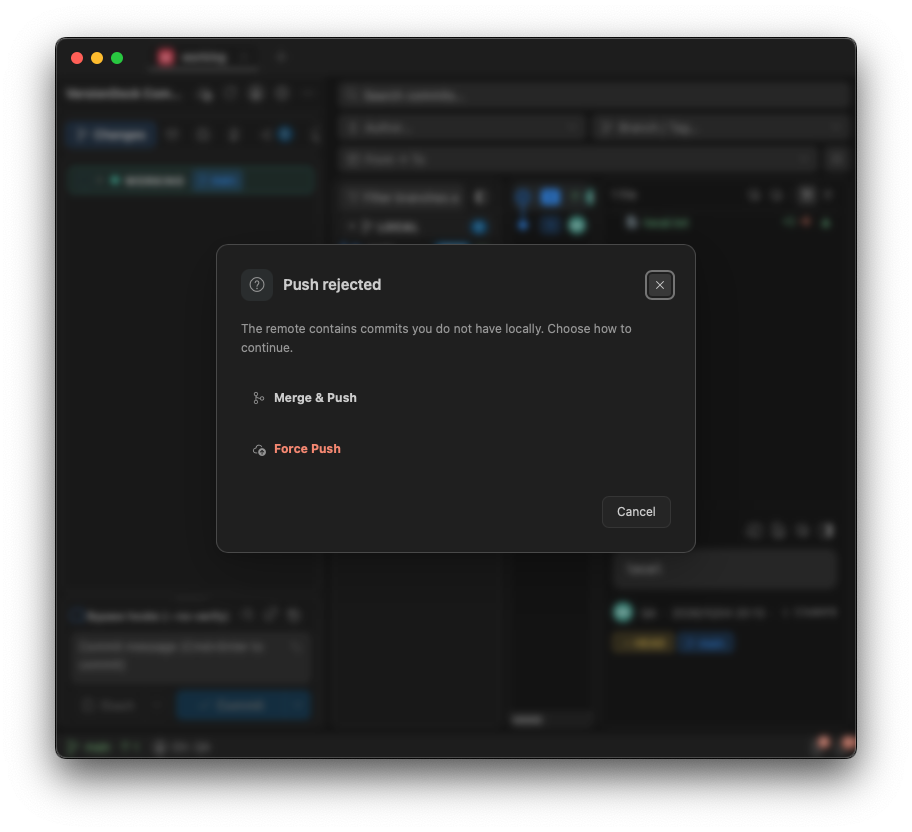
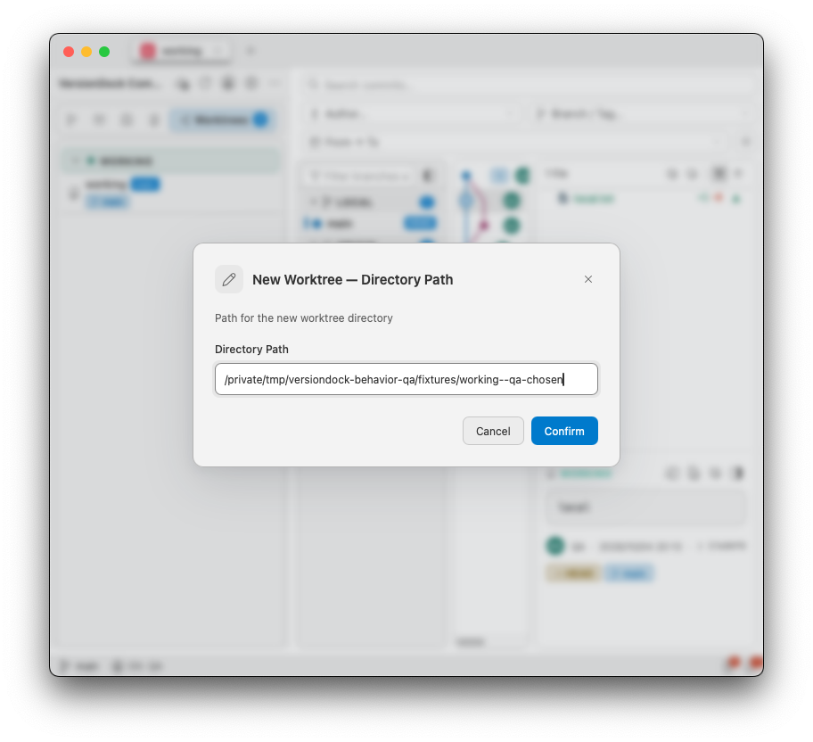
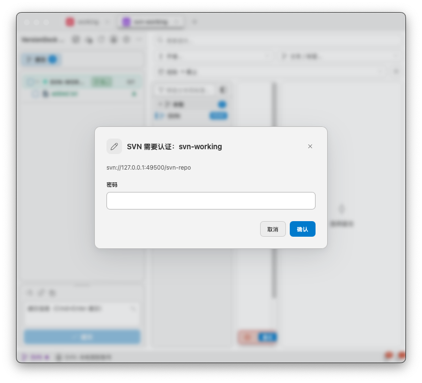

# 操作及设置行为对齐验收（2026-10-04）

仅处理用户选中的两份清单，重复项合并。插件仓库保持只读，没有新增上线兼容迁移、改变默认启动配置或修改通知样式/状态栏 loading。

## 实现

| 问题 | 结果 |
| --- | --- |
| 推送被拒绝后的重试 | 普通和批量提交后推送共用后台恢复链；读取 prompt/error/rebaseAndRetry 和 Merge/Rebase 偏好，保留远端与分支，只重试失败的推送。强推仍验证保护分支授权；取消及更新冲突时停止推送。更新源码仓库时复用稳定的后台更新进程。 |
| Worktree 管理 | 验证 Git 注册列表后允许管理已有 Worktree，保留主工作树删除保护，拒绝无关路径；支持锁定原因。 |
| 创建 Worktree | 分支选择后输入目录，默认仓库同级 repo--branch；原生命令支持路径、起始引用和 no-track 参数。 |
| Changelist 生命周期 | 在仓库锁内读取真实状态并清理已提交/回滚的文件归属，重新修改不继承旧分组。 |
| 搁置恢复 | 保存分组 ID/名称/路径；支持单文件恢复的分组还原，原分组删除后重建。 |
| SVN 扫描 | SVN 固定扫描 4 层，Git 继续使用设置深度。 |
| SVN 认证 | 每个仓库根共用认证输入；用户名/密码分步输入，密码仅放在会话内并通过 stdin 传入。提交消息改用临时文件，避免占用密码 stdin。只重试失败的 SVN 命令，取消不重启整个批量任务。 |
| 多选导出补丁 | 选择目录，每个提交生成 shortHash.patch；Git 内容使用 format-patch，包含二进制变更。 |
| noVerify | 设置变更即时更新当前面板，不因无关设置变化覆盖本次手动选择。 |
| 文件内容转换 | Worktree 和分支与工作区比较读取 filters/textconv/none，共用现有只读转换链。 |

认证和推送恢复弹窗复用现有 DialogHost。后台交互定向发给所属窗口、一次性响应、取消或窗口关闭后清理；认证排队及输入期间暂停请求超时，完成后恢复剩余计时。认证操作结束通知既有身份数据刷新事件，不改变身份栏布局或 loading 样式。

## 自动回归

- 前端 717 项通过，类型检查、ESLint、国际化和构建通过。
- Rust fmt/clippy 通过，最终全量 202 项通过，5 项既有可选测试忽略。
- 首次高并发构建和回归期间，3 个既有时序测试失败；串行全量通过，随后并发全量复核通过。没有为此修改无关业务代码。
- 真实临时 Git/SVN 测试覆盖第二远端 Merge/Rebase 重试、Worktree 自选路径和外部 Worktree 管理/无关路径拒绝、Changelist 清理和搁置后删除分组恢复、文件过滤、独立补丁 git am 及二进制最终 tree、固定 SVN 扫描、svnserve 认证后单次提交和取消未提交。
- 前端回归覆盖凭据输入与密码空白、取消活动/排队弹窗、保留其他弹窗、保护分支强推预检、noVerify 即时响应、暂停认证排队请求计时。

日志：`/tmp/versiondock-parity-frontend-final-tests.log`、`/tmp/versiondock-parity-rust-final.log`、`/tmp/versiondock-parity-build-final.log`。

## macOS 原生运行

使用独立 com.versiondock.behaviorqa 配置、临时本地 Git/SVN 仓库、已有稳定启动参数（--no-watch），未操作用户源码仓库或真实账号。

已验证英文深色 800px 推送恢复菜单、Merge 后真实推送；英文浅色 Worktree 目录输入及创建；当前面板 noVerify 即时变化；中文浅色 SVN 用户名/密码输入与真实提交，以及认证后的身份数据刷新。

截图和命令结果保存在 `/private/tmp/versiondock-behavior-qa/`。真实 svnserve 运行于本机；没有使用 Mock 模拟原生提交，也没有调用外网提供商。Windows/Linux 原生环境未在本机验收。

最终原生复核还验证了 SVN 认证等待超过 12 秒后，排队的历史/分支/标签查询不会因输入等待而提前超时，身份栏显示 `SVN: alice`。批量提交遇到远端分歧时实际选择 Merge，最终 committed/pushed 均为 true；日志只出现一次本地提交。

