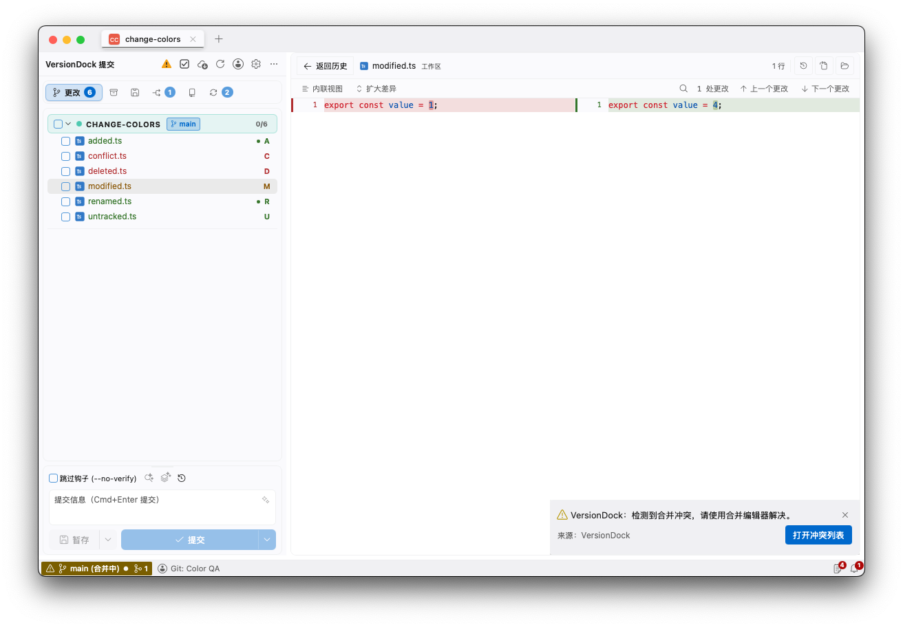
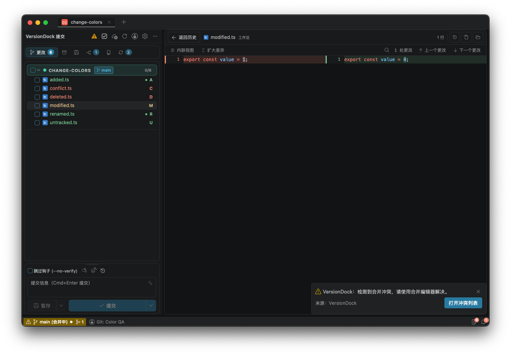

# 文件变更状态配色验证（2026-10-04）

文件名、状态字母和增删统计统一消费主题状态变量。新增、未跟踪、重命名、复制为绿色；修改为琥珀色；删除和冲突为红色。普通操作图标使用既有灰色，选中背景保持中性灰色。

## 验证

- 类型检查、Lint、构建、`git diff --check` 通过；13 个相关测试文件共 154 项通过。
- 独立原生 Tauri 窗口读取临时 Git 仓库，包含新增、删除、修改、重命名、未跟踪及真实合并冲突；没有对用户工作仓库执行写操作。
- 原生验证简化、VS Code、Changelist 提交视图、提交详情、工作树变更列表与 Diff；浅深主题选中后文件名与状态字母配色一致，背景为灰色。
- 原生 WebKit 读取全部 8 种主题预览的计算颜色，新增／修改／删除在各自悬停背景上的对比度均不低于 4.5:1，详见 [计算颜色](theme-colors.json)。
- 暂存、搁置、同步、分支比较及冲突面板完成共用映射接入与相关测试；未逐一完成这些面板的原生截图验收。

## 截图

