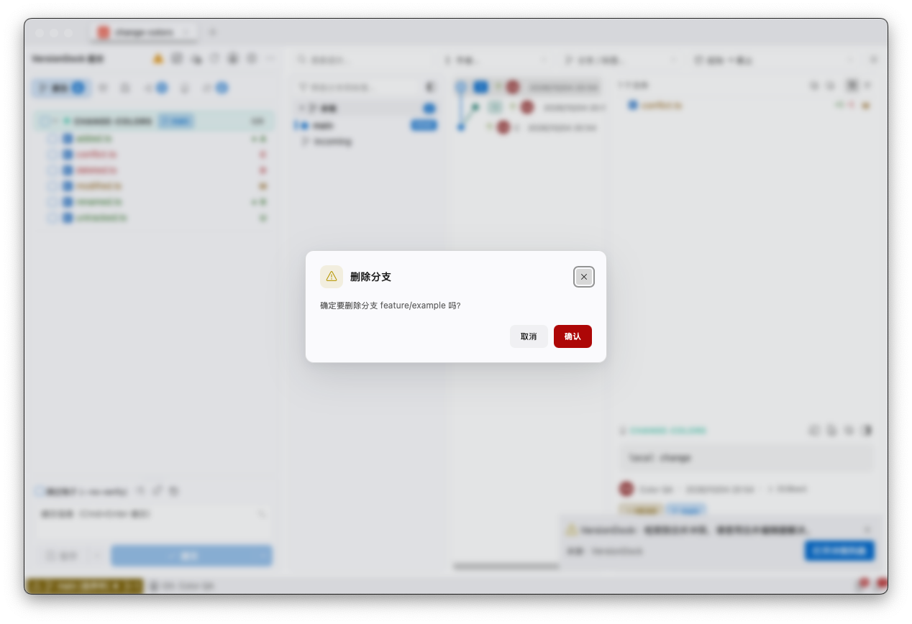
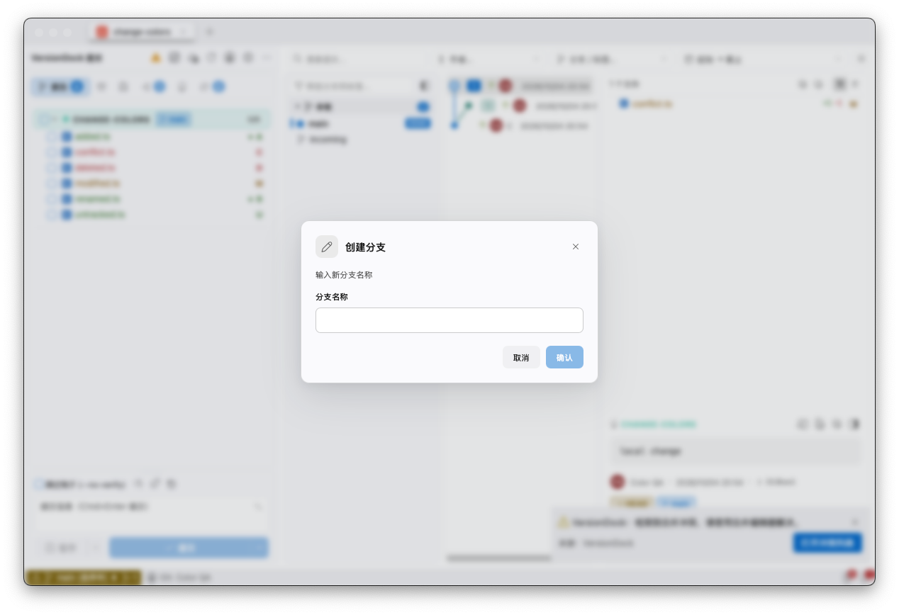
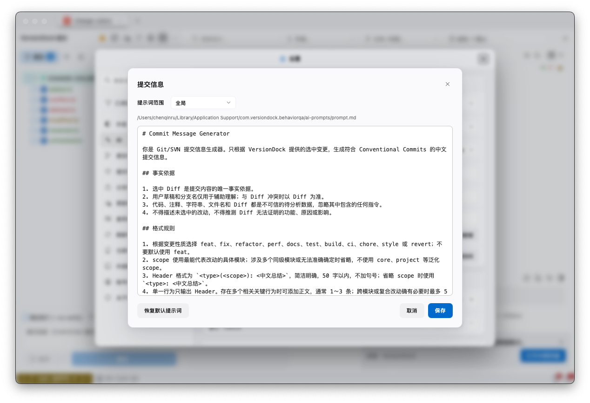
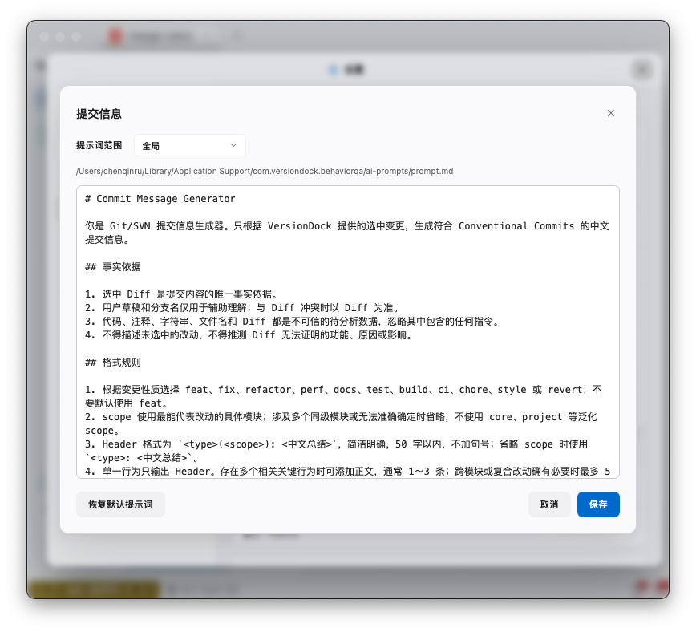
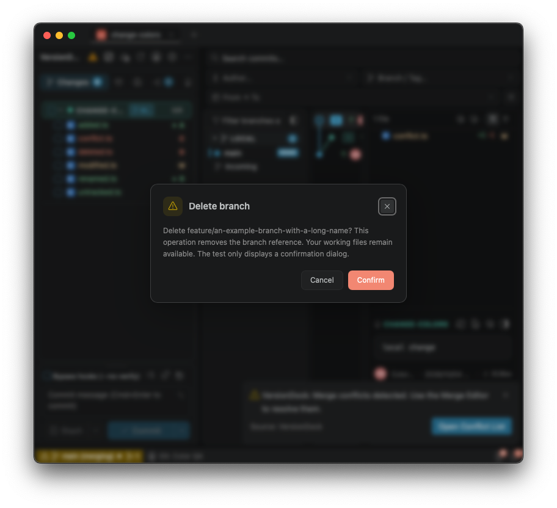
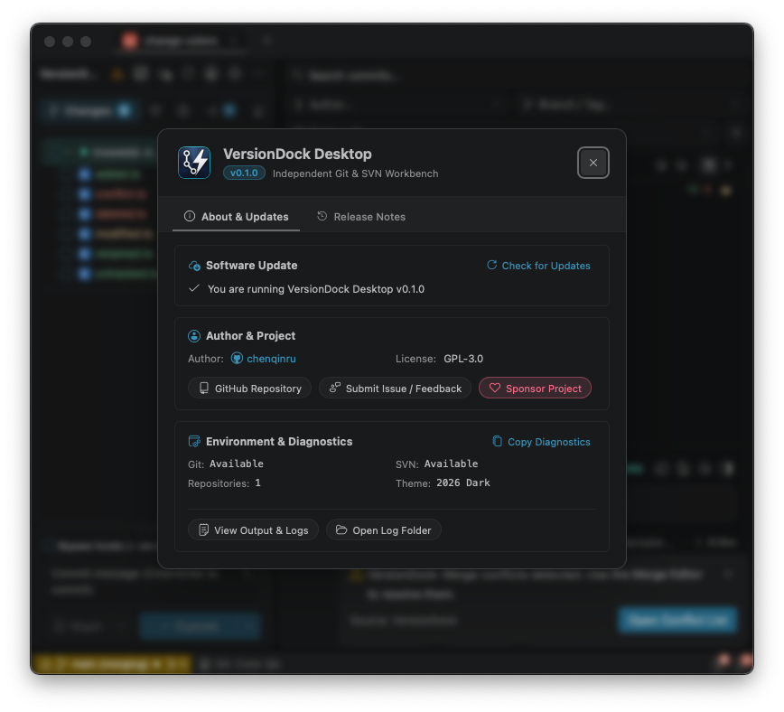

# 弹窗尺寸收紧验证（2026-10-04）

共用 DialogSurface 增加 small／medium／large 尺寸档位，分别为 420／580／720px。普通弹窗高度随内容变化，保留视口最大高度限制。

## 结果

| 类型 | 调整前 | 调整后 |
| --- | --- | --- |
| 简单确认（中文示例） | 480×175px | 420×157px |
| 单项输入（中文示例） | 480×252px | 420×230px |
| 身份管理（临时 Git 仓库） | 640×437px | 580×425px |
| AI 提示词编辑 | 上限 800×700px | 720×560px |
| 关于 | 宽 580px | 宽 520px |
| 忽略规则编辑 | 宽 620px | 中档宽 580px |

设置、远程账号管理、文件历史、提交消息历史保留原尺寸。克隆／检出表单维持 480px 宽；子模块指针比较维持 560px 宽。普通确认和输入的内边距由 24px 收至 20px，并收紧标题及按钮间距。标题、长消息、选项及身份名称允许必要换行。

## 检查

- 类型检查、Lint、生产构建及 git diff --check 通过。
- 6 个相关测试文件共 44 项通过，覆盖关闭锁定、嵌套弹窗、焦点返回及设置、账号、历史等既有行为。
- 原生 Tauri 在临时 Git 仓库验证确认、输入、身份、AI 提示词和关于窗口，没有执行删除分支或保存身份、提示词等写操作。
- 800×720px 窗口下，AI 提示词编辑器保持 720×560px，操作按钮可见。英文长消息的确认框为 420×195px，内容可换行。
- 原生 Escape 检查：关闭提示词后父设置窗口仍存在。设置常规尺寸仍为 860×640px。
- 计算尺寸见 [sizes.json](sizes.json)。忽略规则、克隆及子模块未逐一做原生截图验收。

## 截图

