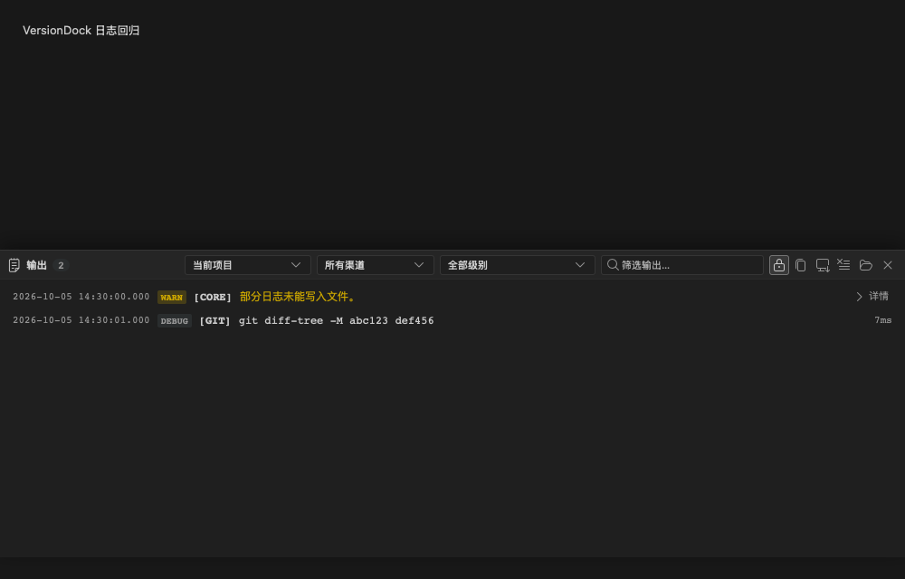
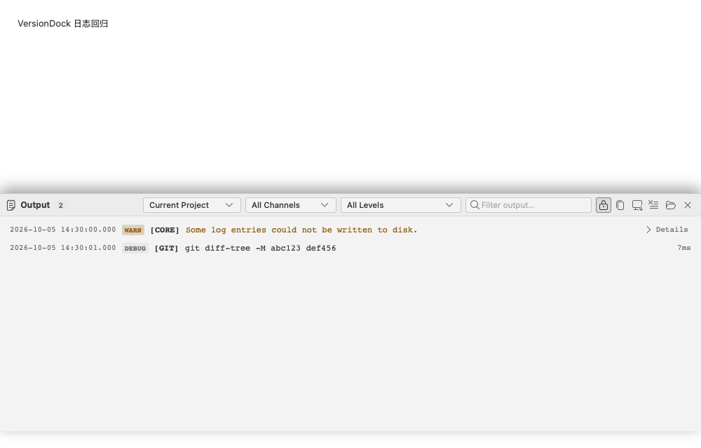

# 日志模块优化与验证

## 行为变化

- SVN 明确的授权／路径访问拒绝使用 `SVN_AUTHORIZATION_FAILED`，保留 ERROR，不进入输入凭据重试。密码与登录认证失败仍沿用原有凭据重试和取消流程。
- SVN 分支／标签查询已按插件 SvnService 对齐：可选标准目录明确不存在时视为正常空结果；授权、网络和解析失败只记录日志，优先保留旧数据，无旧数据时返回当前分支／空标签。成功缓存五分钟，失败冷却三秒，同仓库并发远端查询复用。强制失效保留旧数据，旧请求不能覆盖新缓存；取消仍遵循 App 请求取消协议。
- 手动刷新与后台刷新均不为 SVN 分支／标签读取失败新增右下角错误通知；其他通知行为保持原样。
- Git 祖先判断与 quiet symbolic-ref 的 exit 1、无标准输出／错误输出属于正常否定结果，记 DEBUG，仍保留失败返回语义。无效引用等真正的命令失败保持 ERROR。
- 后台版本检查、SVN 认证缓存读取、svnversion、Git merge-base、diff-tree 等只读命令归 DEBUG；全局参数 -c、-C 和 SVN 认证参数不影响子命令识别。写操作仍保留原有级别与 Git 锁处理。
- 短参数按大小写与子命令识别：Git diff-tree 的 -M、branch 的 -m 不再隐藏后面的参数；真正的提交消息、凭据、Token 和邮箱继续脱敏。
- 关闭被选中的项目后，输出筛选即时恢复当前项目；无活动项目时仅显示无项目归属的系统日志，不显示其他项目记录。保留单个项目的显式筛选选项。
- 入队使用非阻塞方式。满队列时保留内存日志，合并提示；恢复后记录未写入文件的数量，明确说明没有成功持久化，避免无界缓存。文件锁等待上限 2 秒，显式 flush 总等待上限 3 秒。
- 新增错误和存储状态提示支持中英文。

## 验证

- 日志模块前端回归：87 个文件、735 项通过；新增 SVN 查询静默刷新测试后，完整前端测试 737 项通过。
- 完整 Rust 库测试：213 项通过、5 个既有特殊入口／外部服务测试忽略。使用 `VERSIONDOCK_REQUIRE_VCS_TESTS=1`，真实 Git/SVN 工具不可用时不能静默跳过。
- 本地 svnserve 临时仓库：真实授权拒绝时凭据提示次数为 0；无缓存时保留当前分支／空标签，三秒冷却后自动重查；有旧缓存时继续返回 release 与 v1。并发请求只查询一次远端目录，强制失效可立即重新查询。既有密码认证重试／取消回归通过。
- 临时 Git 仓库：祖先否定与分离 HEAD 探测为 DEBUG，无效引用仍为 ERROR。大小写参数和秘密脱敏分别断言。
- 饱和队列模拟：push 不等待写线程；溢出的两条记录保留在内存，恢复后文件记录准确的丢弃计数。真实文件锁验证等待有界且释放后可恢复。
- 类型检查、Lint、国际化检查、构建、Clippy all targets/all features、Rust 格式及 Git diff 空白检查通过。
- 独立 macOS WKWebView 加载真实 OutputPanel、MockBridge 和当前样式，核验中文深色／英文浅色文案及关闭项目后的筛选结果；指标见 [metrics.json](metrics.json)。这是组件原生渲染验证，未替代完整 Tauri App 验收。

所有写操作测试均使用临时仓库，未修改用户工作仓库或插件项目。

