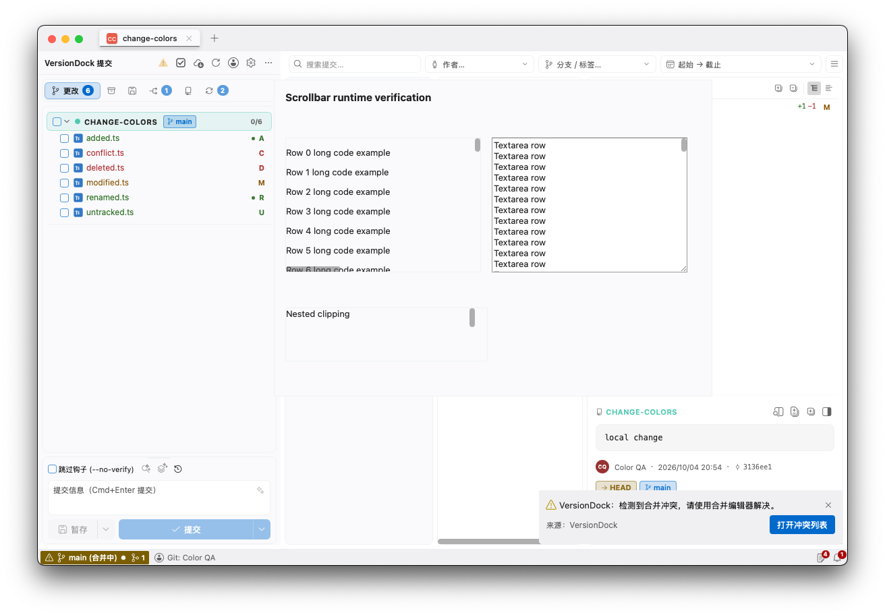
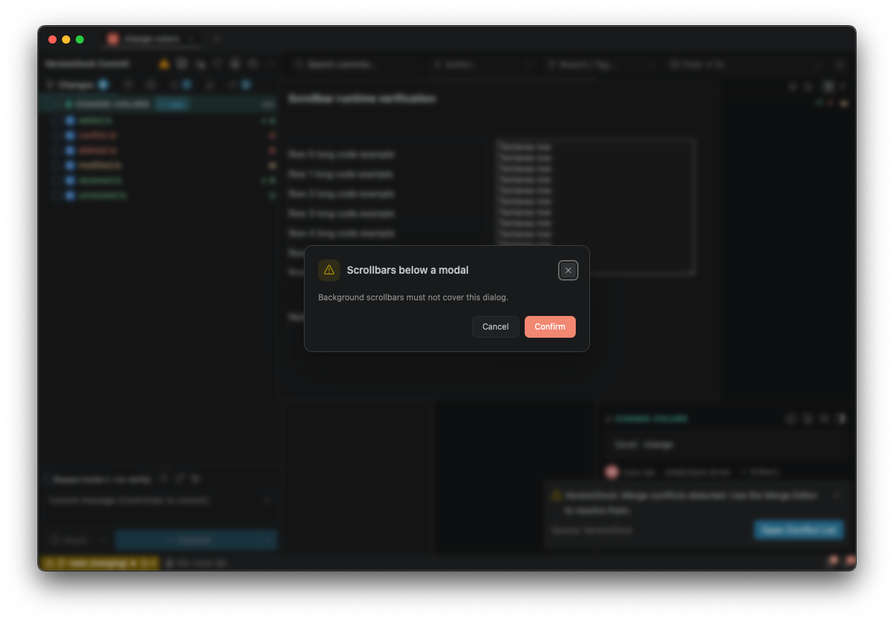
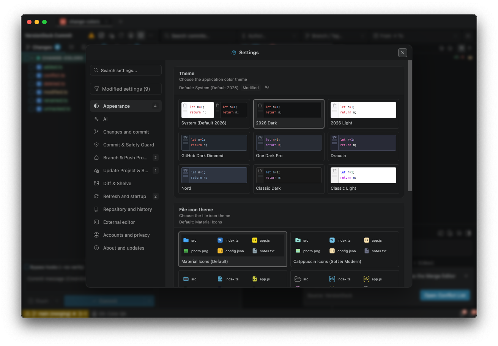
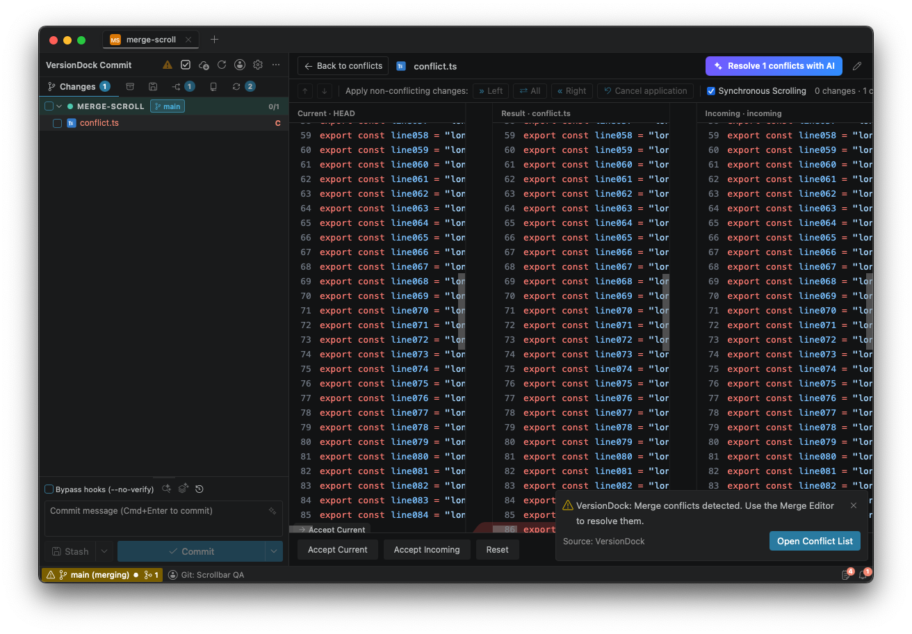

# 全局滚动条同步验证（2026-10-05）

参照插件提交 `88094737fd5744ac8e2456e5fdaa3b12382b56cf`，仅在独立 App 中实现，插件项目保持只读。

## 功能

- 设置 → 外观 → 滚动条显示方式，提供跟随系统（默认）、自动隐藏、始终显示；修改即时生效，支持搜索、默认值说明、修改标记和单项恢复。
- 自动／始终显示模式使用浮动滚动条，原生滚动行为保留，不预留滚动条布局空间；纵横方向支持拖动、轨道点击、滚轮与方向键／Home／End／PageUp／PageDown。
- 自动模式滚动后保留 500ms，淡入 100ms、淡出 800ms，并遵循系统减少动态效果设置。
- 插件 Modern UI 在 App 中对应舒适／紧凑布局：分别为 8px 圆角和 10px 直角。主题颜色采用共用灰色变量。
- 全局扫描及观察新增滚动容器，包含 App 专有的设置、文件历史、Diff、AI 页面、账号管理、通知详情和任务浮层。合并编辑器沿用已有自绘滚动条并接入统一规则，不重复生成。
- WebKit 的悬停选择器返回空集合时，按实际指针位置判定悬停；菜单的外部点击检测识别浮动滚动条所属内容，拖动不会误关菜单。
- 动态内容、窗口调整、弹窗动画结束会更新位置；祖先裁剪及弹窗遮挡有效。切回系统模式及退出窗口会清理观察器、事件、定时器和浮动层。

## 验证

- 86 个前端测试文件、728 项测试通过；类型检查、Lint、国际化检查、构建和 diff 检查通过。
- Rust 设置持久化测试通过：默认 system，重启可恢复 visible；修改不会触发重新扫描、日志重载或自动刷新重启。Clippy 全目标检查通过。
- 原生 WebKit 使用真实临时 Git 仓库与独立 QA 窗口。纵向拖动后 scrollTop 为 1431，横向拖动后 scrollLeft 为 600；未操作用户工作仓库。
- 原生自动模式悬停时 opacity 为 1，移出后为 0；紧凑模式宽 10px、圆角 0，舒适模式宽 8px、圆角 4px。
- 文本框独立滚动、嵌套裁剪、弹窗打开时后台轨道隐藏、system 模式无全局浮动层、设置窗口滚动条均已确认。
- 真实临时合并冲突打开三栏编辑器，恰有 6 条已有自绘滚动条；visible 模式 opacity 均为 1，auto 悬停当前栏为 1，移出后均为 0。没有应用合并结果或提交。
- 本轮原生验证为 macOS WebKit；未完成 Windows／Linux 原生运行验证，也未为每个 App 专有页面分别截图。

详细计算状态见 [metrics.json](metrics.json)。

## 截图

