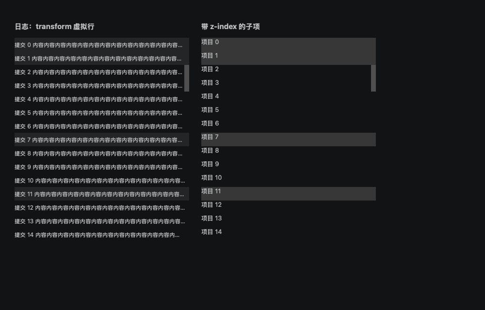
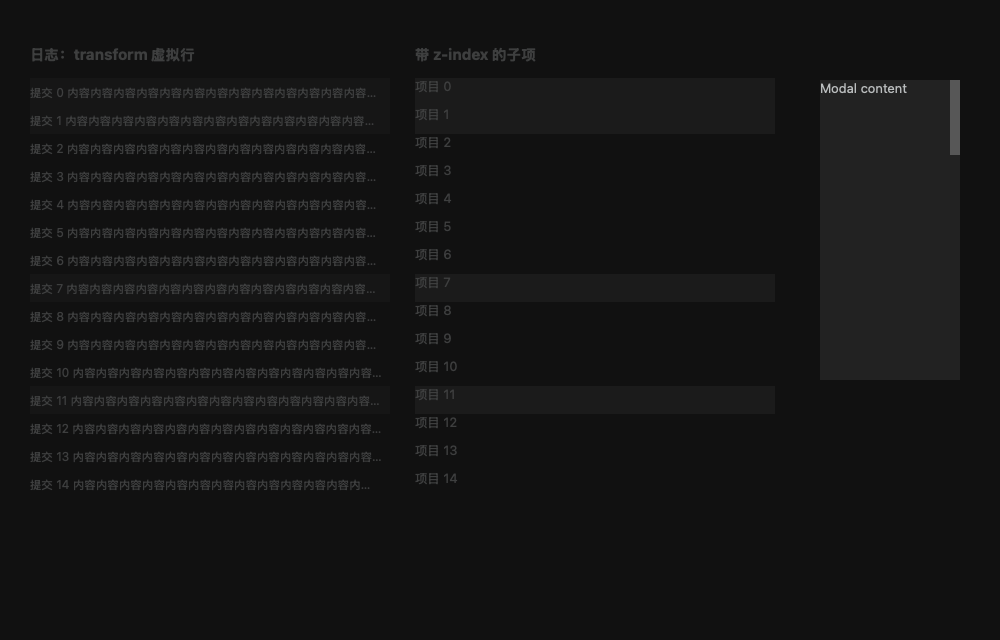

# 滚动条被选中背景遮挡修复

## 根因与排查

日志行在 `historyLog.css` 中设置 `z-index: 2`，仓库条为 3。全局浮动滚动条原先只取滚动容器及祖先的最大 z-index 加 1，普通日志列表得到 1，因此被行背景盖住。

分支列表的 sticky 标题为 4，Diff 固定行号为 2，也有相同层级风险。提交文件树、日志输出使用 transform 虚拟行；通知、任务浮层和设置均使用全局滚动条，统一接入修复。三栏合并编辑器沿用局部自绘轨道 9，行背景层级为 0–6，本次未修改。

## 实现

按 body 下真实的最外层堆叠上下文计算浮动层顺序。没有外层上下文时，计入内容中直接参与外层排序的上下文；有外层上下文时，内部高 z-index 不向外传播，避免将滚动条提升到菜单之上。

计算结果缓存，滚动时复用；DOM、样式、窗口尺寸和动画结束时失效。沿用原有裁剪与遮挡检测。跟随系统模式与通知行为保持原样。

## 验证

独立 macOS WKWebView 验证窗口加载当前滚动条源码及 App 样式，不操作用户仓库。不替代完整 Tauri 页面验收。

- 对照用例恢复旧层级 1：日志选中行与 z-index 4 列表子项遮住滚动条；修复后轨道为 3 和 5，选中行边缘命中 scrollbar。
- 自动模式悬停后日志轨道显示，另一列表仍隐藏。
- 嵌套面板外层 5 时轨道为 6，外部菜单 20 保持在上方。
- 模态层 10000 遮住后台轨道，模态内滚动条为 10001 且正常显示。
- 指标见 [metrics.json](metrics.json)。前端完整测试 87 个文件、734 项通过；类型检查、Lint、构建和 diff 空白检查通过。

