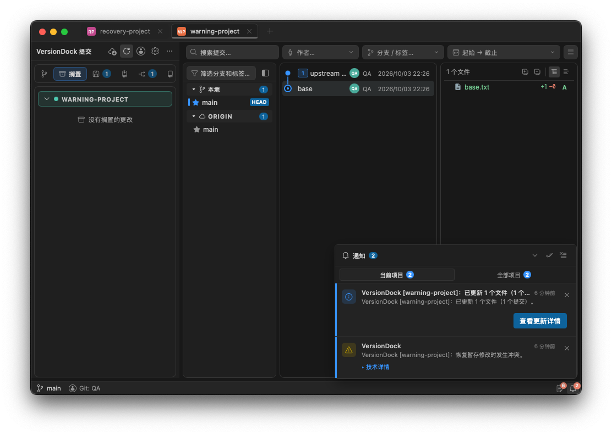

# 更新项目备份与恢复行为核对

日期：2026-10-03。插件只读参考；所有写操作测试均使用新建临时仓库。

## 插件实际行为

- UpdateSummaryService.ts:119-178：更新前按 cleanWorkingTree 配置备份全部改动，默认 Shelve，必要时回退 Stash。
- UpdateSummaryService.ts:289-341：恢复失败时调用 VS Code 的 showWarningMessage；该警告没有“打开备份”等操作按钮。
- UpdateSummaryService.ts:180-208：恢复后的工作副本存在冲突或未结束的版本控制操作时，更新结果判为失败；没有实际冲突时，恢复警告不把成功拉取改判失败。
- UpdateSummaryService.ts:453-567：最终更新结果按成功、失败、部分失败等状态提示；失败且有冲突时提供解决冲突操作。
- GitService.ts:3440-3490：底层拉取保护性 Stash 只处理已跟踪文件，并用 pop --index 恢复；项目更新的外层 Stash 使用普通 pop。
- ShelveService.ts:524-539：Shelve 使用三方应用；有冲突时保留备份，没产生冲突才允许普通 apply 回退。

插件没有“启动／打开项目时扫描旧自动备份并发恢复通知”的流程。上一轮将该额外增强表述成插件复刻不准确，该流程已撤销；扫描状态层、恢复提醒、额外按钮、自动显示隐藏仓库及其旧截图均已删除。

## App 的对应修正

项目更新与底层拉取的备份范围分开处理。恢复失败警告与拉取结果独立传递：无实际冲突时，拉取成功仍保留成功统计；有冲突时，保留备份并返回失败。实际拉取失败时保留原始失败原因，同时报告恢复警告。

只在当前操作发生恢复失败时使用既有提示组件显示插件对应文案，不新增启动恢复提醒或备份按钮。更新前已存在的备份仍可通过原 Shelf/Stash 面板查看，加载项目不会自动应用、删除或提示这些备份。

Bridge 的成功响应／错误对象增加了可选 restoreWarning 字段，用于传递恢复结果；Rust 请求命令和原通知组件没有改动。中英文文案复用插件恢复警告词条。

取消是原任务明确要求的 App 能力：取消更新后保留原暂存状态，等待恢复结束后才返回终态。此前额外增加的开发版更新自身源码拦截及其提示已移除；更新按插件的备份、拉取和恢复流程执行，通知样式、原通知发布机制及默认启动配置不变。

## 验证

- 前端完整检查通过：656 项测试。
- Rust 全量测试：165 项通过，2 项忽略；其中一个忽略项是由中断父测试显式运行的子进程入口，另一个为原有跳过项。
- fmt、全部目标／特性的 clippy、生成绑定检查及 diff 检查通过。
- 真实临时仓库验证 Stash／Shelve 的内容恢复、取消、存储失败回退和进程被终止后的备份保留。
- 真实同名文件场景：Shelf 三方恢复产生工作副本冲突时返回失败并保留备份；Stash 只恢复未跟踪文件失败、没有 Git 冲突时，实际拉取仍成功，提交统计保留，Stash 中仍有原始本地文件。

原生 Tauri 验证使用已有稳定启动参数和独立 QA 标识，仅操作 `/private/tmp/versiondock-update-warning-qa` 及先前创建的临时项目。首次打开有旧自动 Shelf 的项目，没有新增启动提醒；实际更新成功但 Stash 恢复失败时，显示更新结果和无附加操作按钮的恢复警告。[原生结果](native-results.json)

补充验证：移除开发版自身源码更新拦截后，前端完整检查通过（656 项测试及构建）；Rust 全量回归通过（164 项通过、2 项忽略），包含真实临时 Git 更新／恢复／取消测试。源码仓库未执行更新测试，通知组件与分支状态栏组件相对改动前没有差异。

## 修复开发监听中断恢复

23:14:30 的原生日志显示：创建自动 Shelf、清空工作区后，开发监听重启 App；没有执行恢复补丁。本次备份对象 `44d146c9b1a0473f55ab16822d1ae5ee5755b728` 中的 30 个文件和 index 父对象已逐字节恢复。未重新恢复此前明确撤销的 4 个 AD 文件，原自动 Shelf 保留，仓库外备份位于 `/Volumes/WorkSSD/Codex/tmp/versiondock-update-recovery-20261003-231430`。

开发版更新自身源码由复制至系统临时目录的独立原生进程执行同一更新事务。UI 进程被重启或结束，更新和恢复仍继续；明确取消通过输入管道传递，恢复结束后才返回。仓库级文件锁阻止重启后的 App 写操作与独立更新进程并发写入，进程退出自动释放锁，不自动删除 Git 的 index.lock。没有新增通知、启动备份扫描、恢复按钮或开发版更新拦截。默认启动配置未改。

同时修正 Shelf 补丁与插件的细节差异：已跟踪文件使用 HEAD 到工作区的 binary diff，未跟踪内容单独从捕获对象取得；已暂存新增后在工作区删除的文件不会在更新恢复时复活。

验证：真实临时 Git 仓库中强制杀死父进程，Shelve 和 Stash 更新均自动完成拉取及恢复；明确取消等待恢复、保留 Stash 暂存区别；新进程写操作等待仓库文件锁并可取消。原生 App 可执行程序单独验证父输入断开继续更新、取消恢复及已暂存新增后删除的文件保持不存在。[原生独立更新结果](native-worker-results.json)、[原生 Shelf 工作区一致性](native-shelf-worktree-parity.json)。最终 Rust 全量 166 项通过、4 项忽略；前端 657 项通过及生产构建成功，fmt、全目标／特性 clippy、生成绑定和 diff 检查通过。
